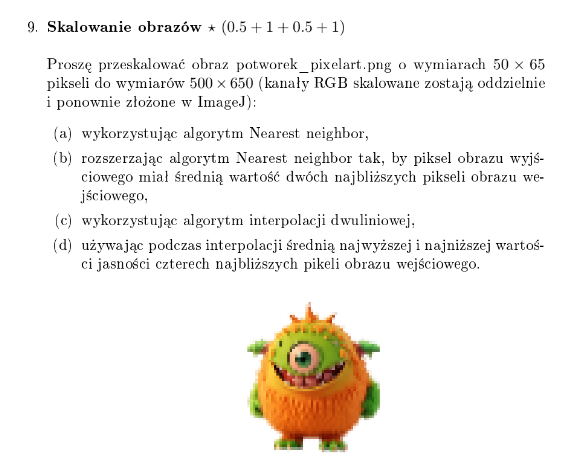
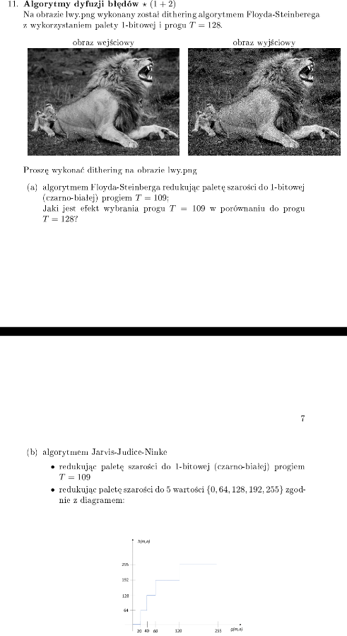
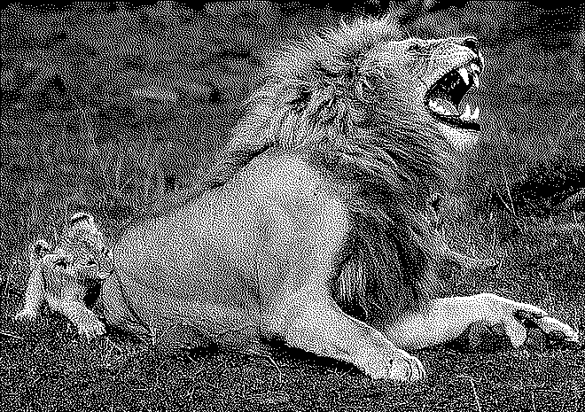
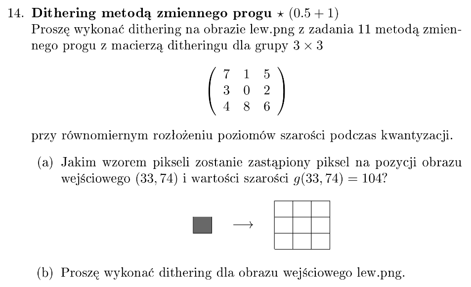
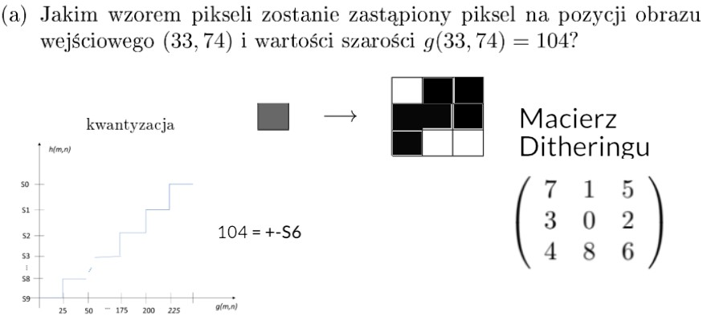
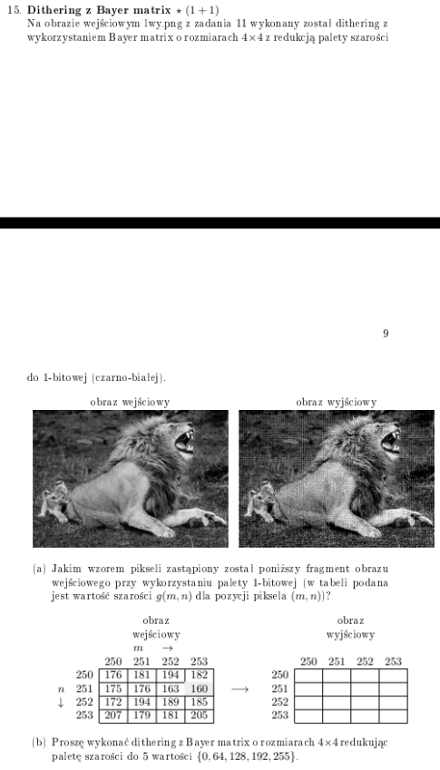
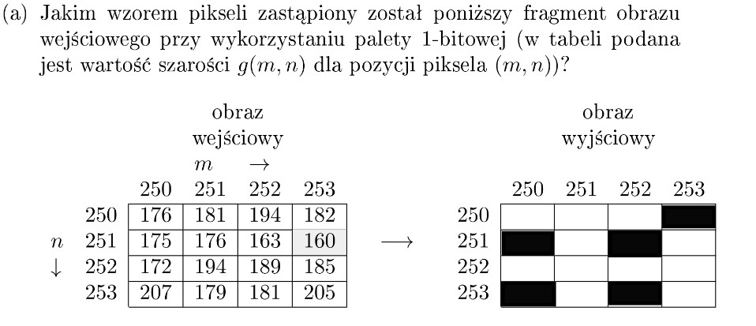

# Przetwarzanie Obrazów Cyfrowych - Zestaw 1

## Zadanie 9

### Treść

### Rozwiązania

|  Rys. 9a |  Rys. 9b |
|:--:|:--:|
|  Rys. 9c |  Rys. 9d |

### Kod
- [kod 9b](zad9/9b.py)
- [kod 9d](zad9/9d.py)

## Zadanie 11

### Treść

### Rozwiązania

#### oryginał

#### a.

[kod 11a](zad11/11a.py)

#### b.

[kod 11b](zad11/11b.py)

## Zadanie 14

### Treść

### Rozwiązania

#### oryginał

#### a.

#### b.

[kod 14b](zad14/14b.py)

## Zadanie 15

### Treść

### Rozwiązania

#### oryginał

#### a.

[kod 15a](zad15/15a.py)

#### b.

[kod 15b](zad15/15b.py)