# Przetwarzanie Obrazów Cyfrowych - Zestaw 2

## Zadanie 1

### Treść

Próbkowanie sygnału / aliasing (1 + 0.5 + 0.5)

Płytka strefowa Fresnela na obrazie poniżej (kosinusoidalny wzór pierścieni, `PlytkaFresnela.png`) posiada w reprezentacji 8‑bitowej wartości intensywności I obliczone według wzoru:

$$I(r) = 127 - 0{,}5\cdot\cos(\dots) + 128$$

gdzie r to odległość do środka obrazu w pikselach.

a) Utworzyć w ImageJ profil liniowy wzdłuż środka obrazu płytki strefowej Fresnela (Analyze → Plot Profile, a następnie wybrać opcję "More High‑Resolution Plot").  
- Zinterpretować profil liniowy obrazu jako sygnał.  
- Na grafice oznaczyć punkty próbkowania dla częstotliwości próbkowania f = 1/50 pikseli (tj. odstęp 50 pikseli).  
- Wskazać obszary, w których przy tak wybranej częstotliwości rekonstrukcja sygnału nie jest możliwa (aliasing).  
- Oszacować minimalną częstotliwość próbkowania f_min wymaganą do poprawnej rekonstrukcji.

b) Płytka strefowa Fresnela ma zostać próbkowana 30 punktami na krawędź (30 × 30 prób).  
- W ImageJ wykonać próbkowanie (redukcję liczby pikseli do 30×30 bez interpolacji) i zrekonstruować obraz.  
- Wyjaśnić efekt digitalizacji widoczny na zrekonstruowanym obrazie i zaznaczyć obiekty‑aliasy.

c) Wykonać próbkowanie obrazu z częstotliwością f_min wyznaczoną w części (a) i porównać rezultat z próbami z części (b).
- Zanotować różnice w jakości rekonstrukcji i obecności aliasów.
- Przygotować krótką analizę i wnioski.

### Rozwiązania

#### a.

- Minimalna częstotliwość próbkowania f_min wynosi około 1/20 pikseli (odstęp 20 pikseli).

#### b.

- Na zrekonstruowanym obrazie widoczne są aliasy, które objawiają się jako nieprawidłowe wzory i zniekształcenia w obszarach o wysokiej częstotliwości.

#### c.

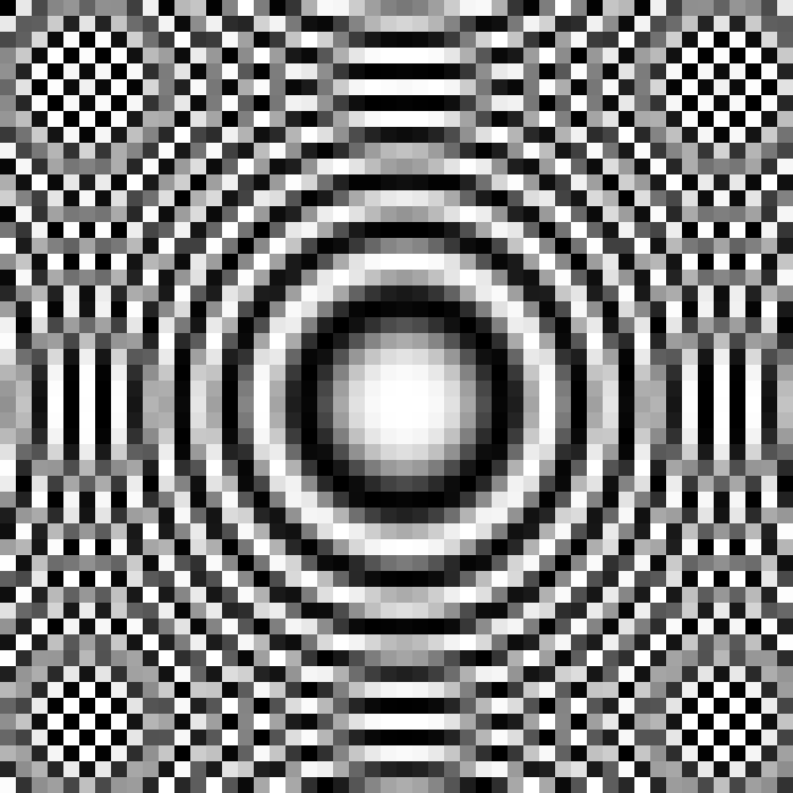
- Rekonstrukcja przy częstotliwości f_min jest znacznie lepsza, z mniejszą ilością aliasów i lepszym odwzorowaniem oryginalnego obrazu.

## Zadanie 3
Charakterystyka jakościowa obrazów ⋆ (0.5 + 1)
Proszę wyznaczyć kontrast globalny i lokalny w obrazach tygrysA.png,
tygrysB.png i tygrysC.png.
Przy wyznaczaniu kontrastu lokalnego proszę przyjąć następujące sąsiedztwo g_nb dla każdego piksela g (sąsiedztwo ośmiospójne):

### Rozwiązania

Definicje użyte w obliczeniach:
- Kontrast globalny (Michelsona): K = (I_max − I_min) / (I_max + I_min) (dla obrazu w skali szarości)
- Kontrast lokalny (Webera) dla piksela g: K_W(g) = (g − średnia_sąsiedztwa) / średnia_sąsiedztwa, gdzie sąsiedztwo to 8‑sąsiedztwo
- Kontrast lokalny (Michelsona) w oknie 3×3: K_M_local = (max − min) / (max + min)

Skrypt: `zad3/kontrast.py` (Python, PIL+NumPy). Wyniki liczbowe:

- tygrysA: Global Michelson = 1.0000; Local Weber |mean| = 0.0659 (median 0.0227); Local Michelson mean = 0.2009 (median 0.1087)
- tygrysB: Global Michelson = 1.0000; Local Weber |mean| = 0.0475 (median 0.0161); Local Michelson mean = 0.1502 (median 0.0764)
- tygrysC: Global Michelson = 0.6784; Local Weber |mean| = 0.0335 (median 0.0141); Local Michelson mean = 0.1035 (median 0.0667)

Mapy kontrastu lokalnego (wizualizacja):

tygrysA — Weber |K_W| (po lewej) i lokalny Michelson (po prawej)

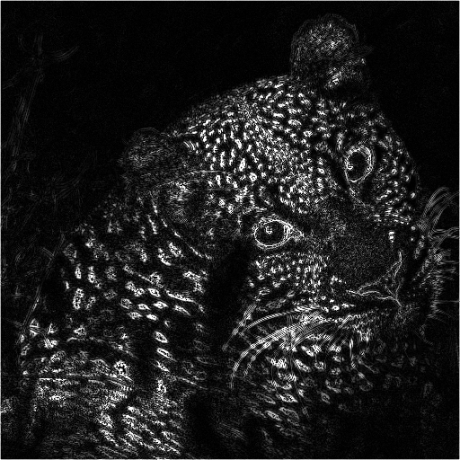 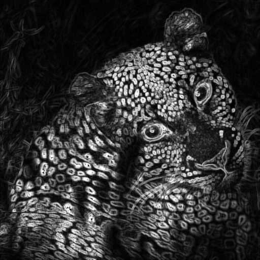

tygrysB — Weber |K_W| (po lewej) i lokalny Michelson (po prawej)

 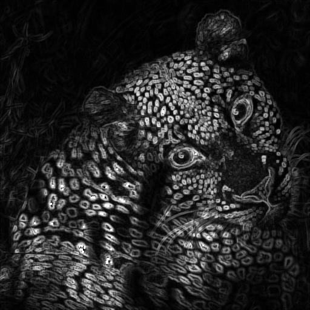

tygrysC — Weber |K_W| (po lewej) i lokalny Michelson (po prawej)

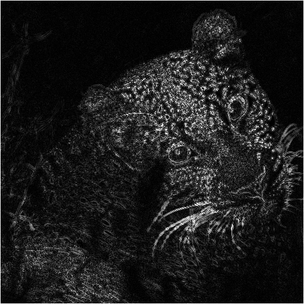 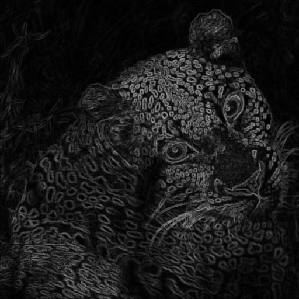

## Zadanie 4
Ocena jakości obrazów – MSE ⋆ (1)
Proszę wyznaczyć MSE dla obrazów w formacie GIF i JPEG (osaRGB_GIF.gif
i osaRGB_JPG.jpg) w przypadku, gdy obrazem referencyjnym jest obraz
osaRGB_PNG.png.
Który z obrazów jest lepszej jakości w znaczeniu metryki MSE?

Wskazówka: Dla obrazów RGB wyznacza się MSE osobno dla każdego
kanału, a następnie uśrednia wynik.

### Rozwiązania

Skrypt: `zad4/mse.py` (Python, PIL+NumPy). Referencja: `osaRGB_PNG.png`. Porównania: `osaRGB_gif.gif`, `osaRGB_JPG.jpg`.

Wyniki MSE (niższe = lepsze):

- GIF vs PNG: MSE_R = 370.56, MSE_G = 259.24, MSE_B = 393.36, MSE_avg = 341.05
- JPG vs PNG: MSE_R = 51.35,  MSE_G = 30.92,  MSE_B = 66.76,  MSE_avg = 49.68

Wg metryki MSE lepszą jakość ma JPEG (niższy błąd średniokwadratowy).

Wizualizacje błędu (|ref − test|, skala z percentyla 95):

GIF: 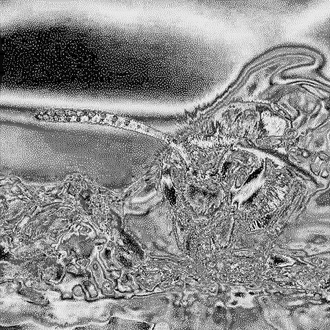  JPG: 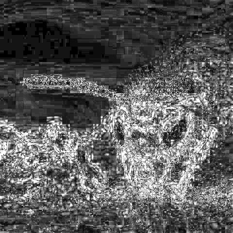

## Zadanie 10
DFT (FFT) w ImageJ ⋆ (0.5 + 1.5)
### a.
Dla obrazów `koszulaA.png` i `koszulaB.png` proszę wyznaczyć w ImageJ DFT (FFT).
Proszę zinterpretować różnicę między DFT obu obrazów.

### b.
W widmie Fouriera obrazu pewne obszary mogą zostać wyeliminowane (filtrowane), jak pokazują czarne obszary na obrazach A, B, C
i D poniżej. Po przeprowadzeniu odwrotnej transformacji Fouriera
ponownie otrzymuje się obraz.
Proszę wykonać w ImageJ operacje filtracji widma zgodnie z obrazami A, B, C i D dla obrazu `koszulaA.png`.
Proszę zinterpretować wyniki.
(Uwaga dotycząca usuwania obszarów w ImageJ: Edit → Options →
Colors → Background = Black, następnie Clear).

### Rozwiązania

#### oryginały

 

#### a. Widma FFT

Skrypt: `zad10/fft_filters.py` (Python, NumPy/PIL). Wygenerowano widma mocy (logarytmiczne) dla obu obrazów.

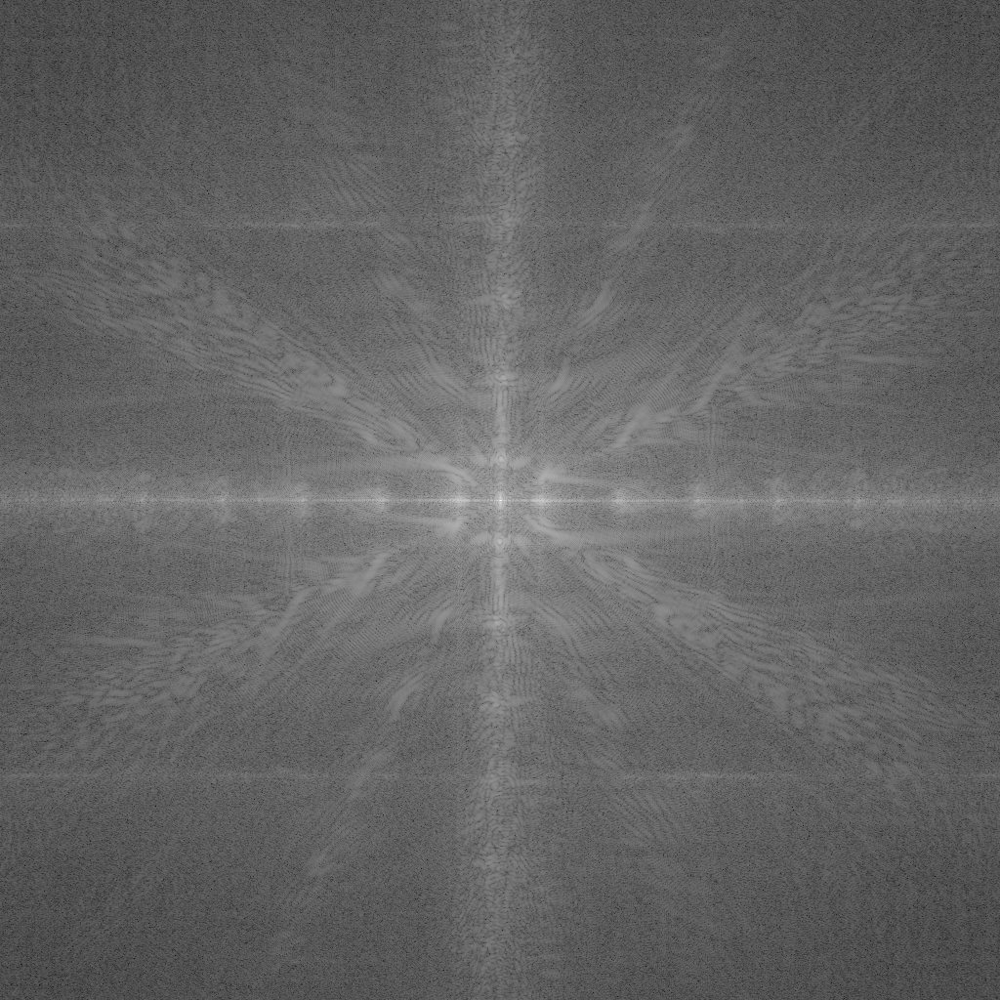 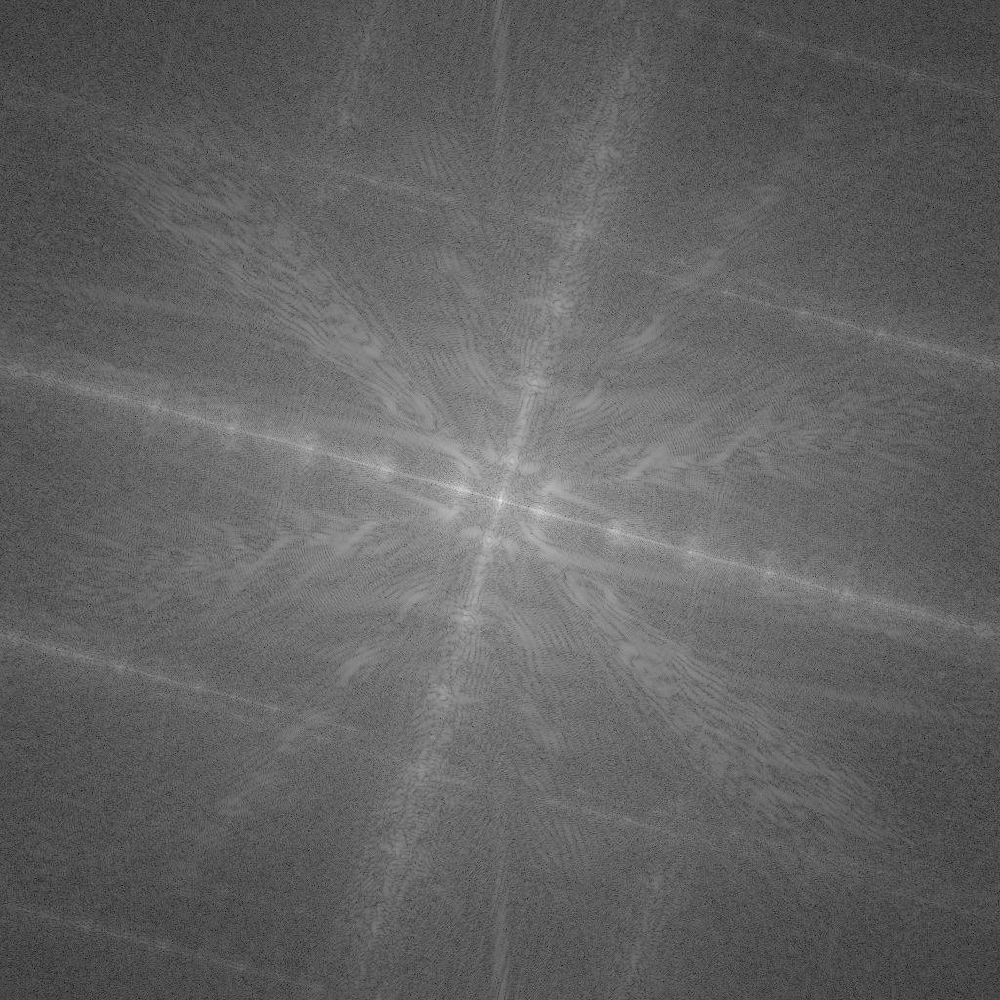

#### b. Filtracja widma

Zastosowano cztery maski filtrujące (A, B, C, D) do widma koszulaA (czarne obszary na maskach blokują dane częstotliwości). Wyniki po odwrotnej FFT:

| Maska | Widmo po filtracji | Koszula A po IFFT | Koszula B po IFFT |
|-------|-------------------|---------------|---------------|
| A | 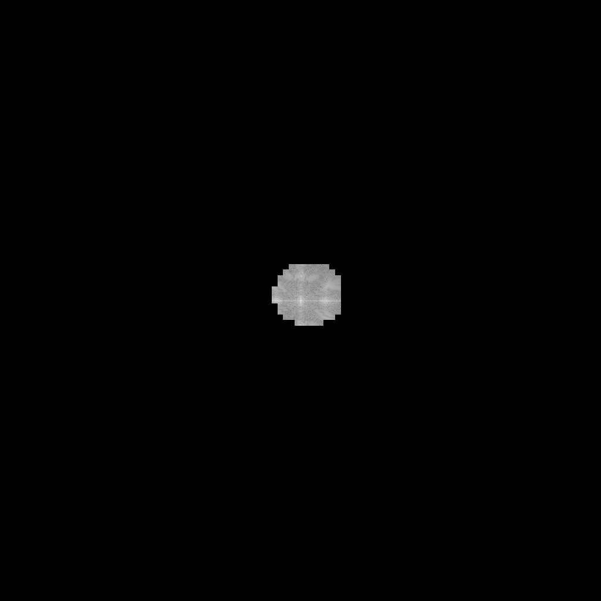 |  |  |
| B | 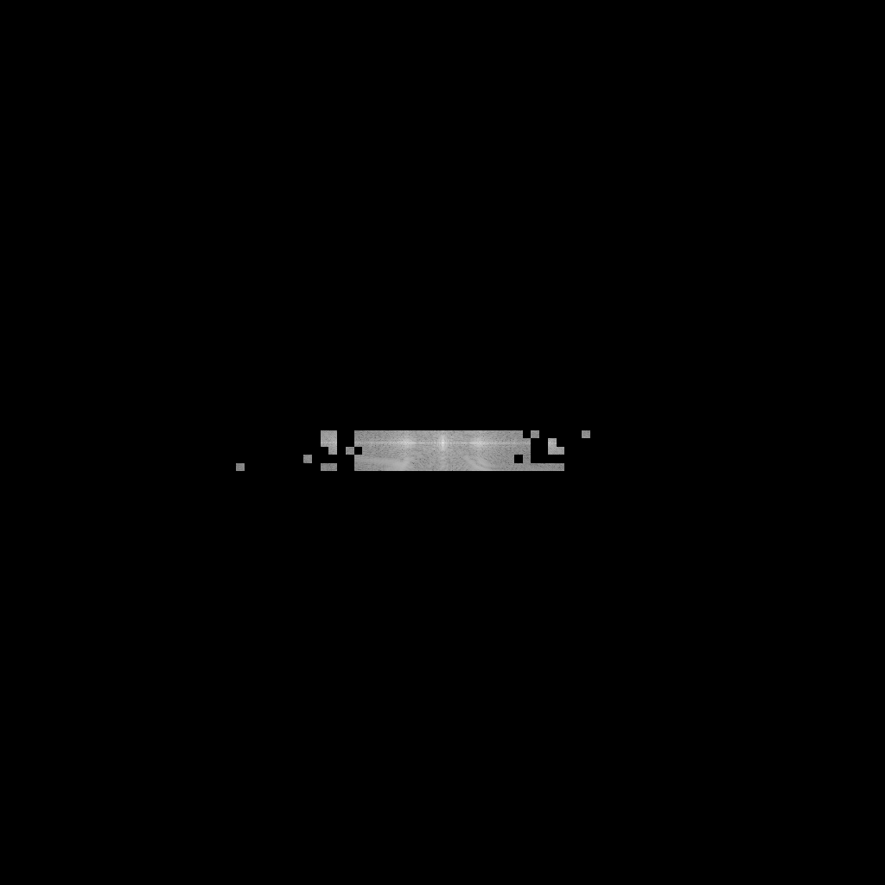 |  |  |
| C |  | 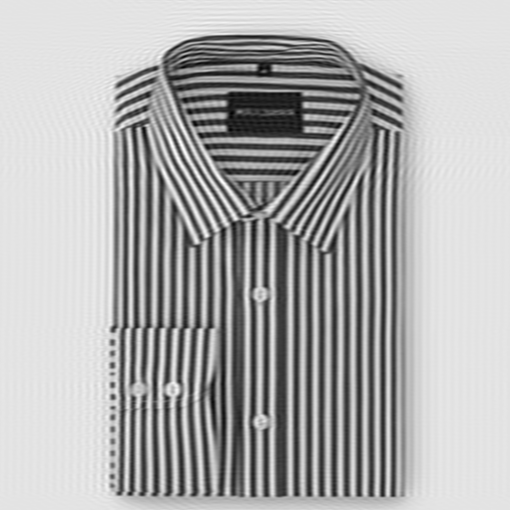 | 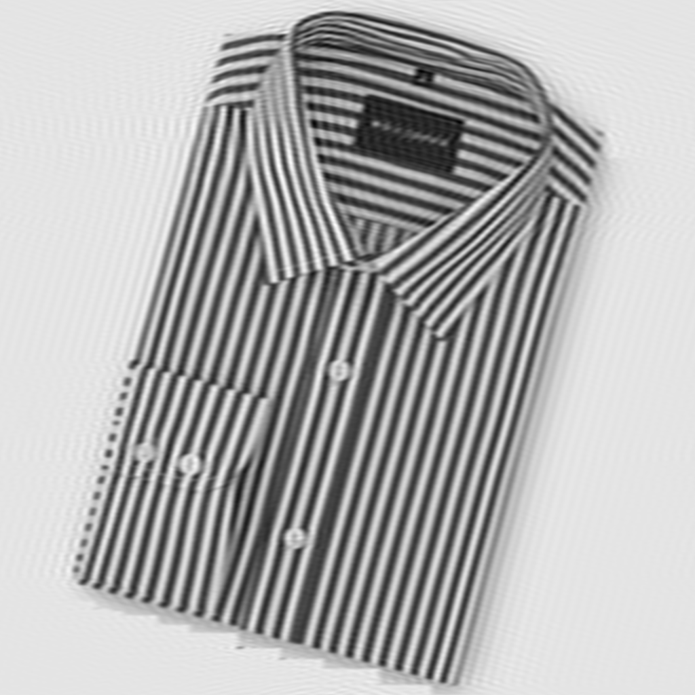 |
| D | 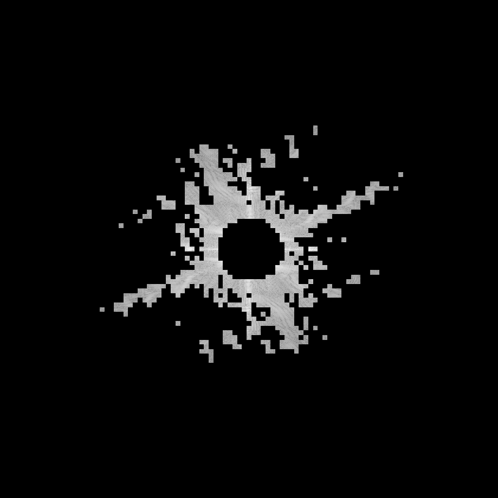 | 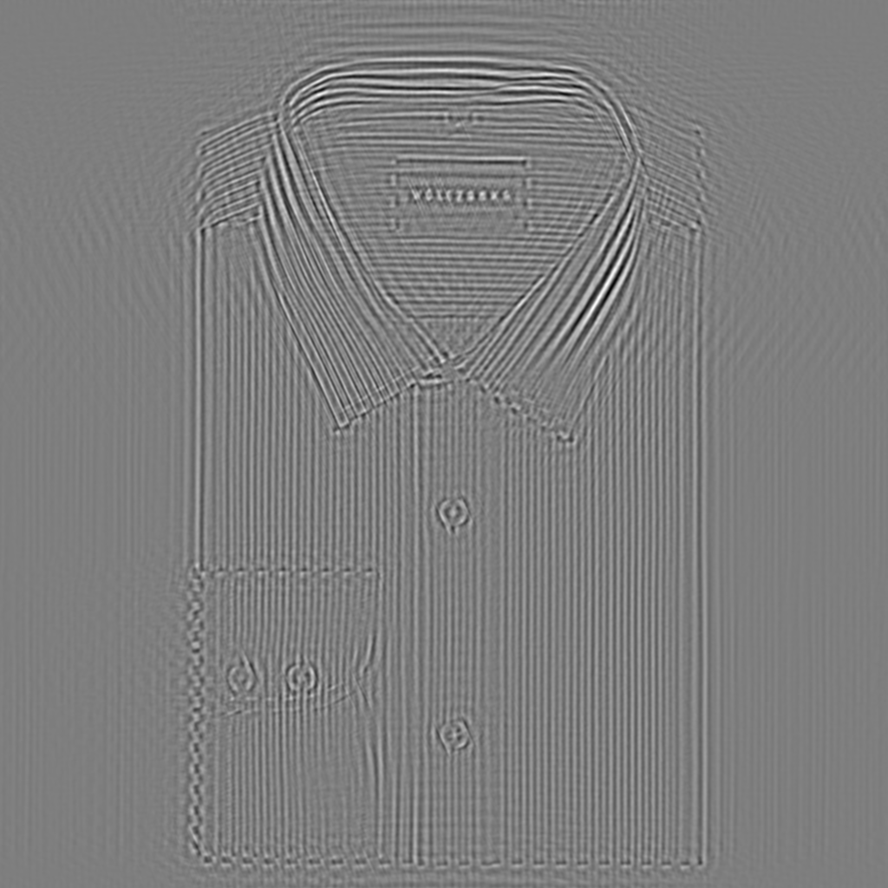 |  |

## Zadanie 11
Efekt Gibbsa ⋆ (0.5 + 1.5)
### a.
Proszę utworzyć w ImageJ kwadratowy obraz (o rozmiarach będących potęgą
liczby 2) przedstawiający biały pasek na czarnym tle (rysunek poniżej).
Jaki kierunek posiadają fale płaskie, z których zbudowany jest ten obraz?
### b.
Proszę dokonać aproksymacji widma obrazu przez dwa skończone szeregi Fouriera
o różnych długościach, zrekonstruować powstałe obrazy (zastosować odwrotną
transformację Fouriera) i utworzyć profile liniowe wzdłuż osi poziomej.
Proszę wyjaśnić zjawisko widoczne na rekonstrukcjach i na profilach liniowych.

### Rozwiązania

Skrypt: `zad11/gibbs.py` (Python, NumPy/PIL/Matplotlib). Rozmiar obrazu: 256×256 px (potęga 2).

#### a. Obraz paska i kierunek fal płaskich

Pionowy biały pasek na czarnym tle.

**Kierunek fal płaskich:** Dla pionowego paska (struktura zmienia się głównie w kierunku poziomym) dominują **fale płaskie poziome** (propagujące się w kierunku pionowym). W widmie FFT widoczna jest intensywna linia pozioma przez centrum, co potwierdza, że silne składowe częstotliwościowe mają kierunek poziomy (odpowiadają zmianom w kierunku x).

Widmo FFT (logarytmiczne):

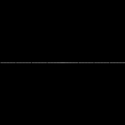

#### b. Aproksymacje widma i efekt Gibbsa

Utworzono dwie aproksymacje widma przez ograniczenie do skończonej liczby składowych Fouriera:
- **Aproksymacja 20%**: zatrzymano tylko centralne 20% widma (niskie częstotliwości).
- **Aproksymacja 50%**: zatrzymano centralne 50% widma (więcej składowych).

**Rekonstrukcje po odwrotnej FFT:**

| Aproksymacja | Widmo (log) | Obraz po IFFT |
|-------------|-------------|---------------|
| 20% widma   | 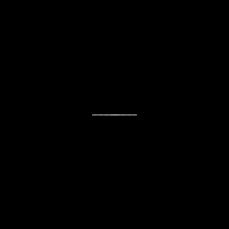 |  |
| 50% widma   | 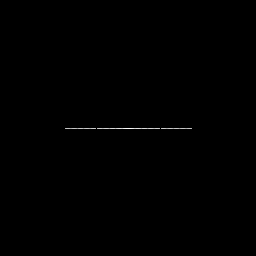 | 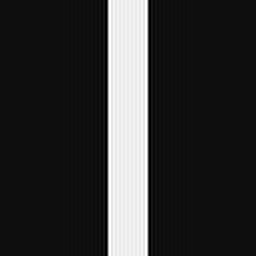 |

**Profile liniowe poziome przez środek obrazu:**

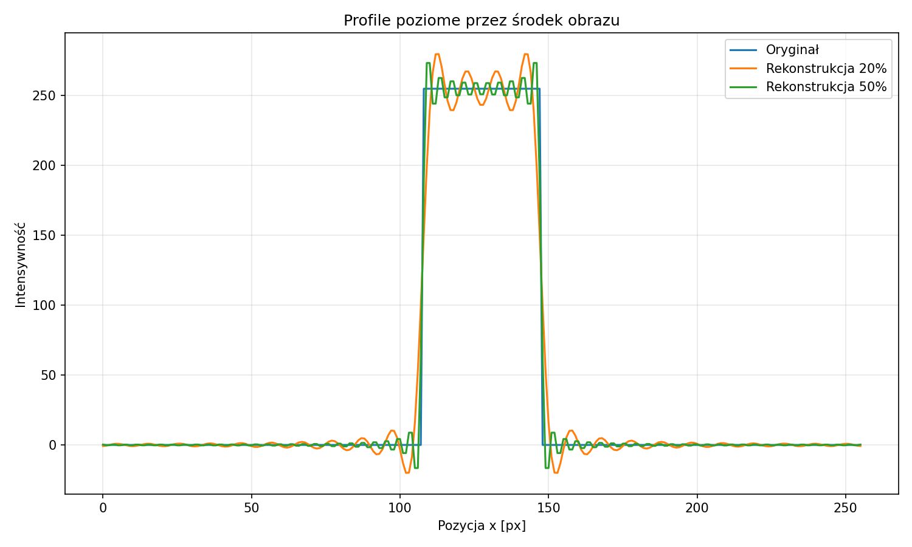

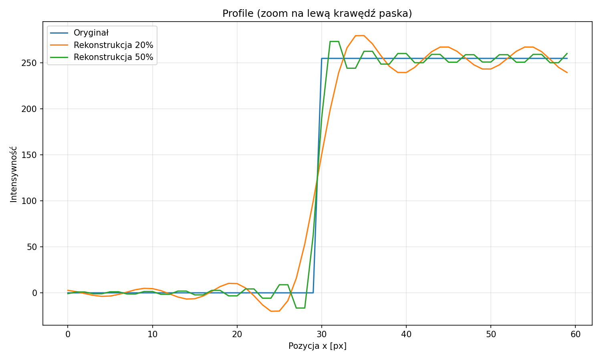

**Interpretacja efektu Gibbsa:**

1. **Oscylacje przy krawędziach**: W profilach liniowych widoczne są charakterystyczne oscylacje (overshoot i undershoot) wokół ostrych przejść 0→255. To **efekt Gibbsa**.

2. **Przyczyna**: Obcięcie szeregu Fouriera (ograniczenie do skończonej liczby składowych) powoduje, że rekonstrukcja nie może dokładnie odtworzyć ostrej nieciągłości. Szereg Fouriera aproksymuje skok funkcją ciągłą z oscylacjami.

3. **Zależność od liczby składowych**:
   - Aproksymacja 20% (mniej składowych) → silniejsze oscylacje, szersze "rozmycie" krawędzi.
   - Aproksymacja 50% (więcej składowych) → mniejsze oscylacje, ostrzejsza krawędź, ale wciąż widoczny overshoot (~9% amplitudy skoku).

4. **Amplituda oscylacji**: Maksymalny overshoot Gibbsa wynosi ~9% wysokości skoku (niezależnie od liczby składowych) — oscylacje stają się coraz węższe, ale nie znikają całkowicie przy zwiększaniu liczby składowych.

5. **Praktyczne konsekwencje**: Efekt Gibbsa jest charakterystyczny dla wszystkich aproksymacji/filtracji w dziedzinie częstotliwości z ostrymi odcięciami (hard cutoff). W praktyce stosuje się okna (np. Hann, Hamming), które łagodzą to zjawisko.