# Przetwarzanie obrazów cyfrowych - Zestaw 3

## Zadanie 4
### Treść
Binaryzacja histogramu ⋆ (0.5 + 1.0 + 1.0)

Dla obrazu `kwiatki.png` proszę wyznaczyć obrazy wyjściowe w przypadku:


(a) progowania obrazu wartością progową T obliczoną metodą Otsu (progowanie globalne),

(b) iteracyjnego trójklasowego progowania obrazu w oparciu o metodę
Otsu z warunkiem Δ < 2,

(c) progowania wartościami lokalnymi progów obliczonych metodą Otsu
w sąsiedztwie 11×11 dla każdego piksela. Jeżeli sąsiedztwo wykracza
poza obszar obrazu należy przyjąć w obliczeniach symetryczne odbicie obrazu.

### Rozwiązania

Skrypt: `zad4/otsu.py` (Python, NumPy/PIL). Obraz wejściowy: `kwiatki.png` (1024×1024 px).

#### (a) Progowanie globalne metodą Otsu

Wyznaczono optymalny próg globalny metodą Otsu (maksymalizacja wariancji międzyklasowej):

**T = 166**

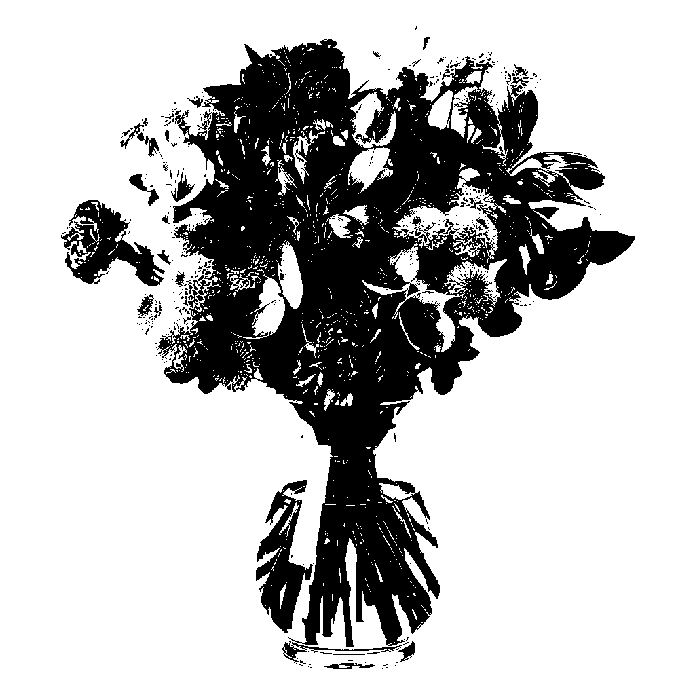

#### (b) Trójklasowe iteracyjne progowanie Otsu

Iteracyjny algorytm dzieli obraz na 3 klasy (ciemna, średnia, jasna) i aktualizuje progi T1 i T2 do zbieżności (Δ < 2):

**T1 = 104, T2 = 200**

Obraz wyjściowy z trzema poziomami intensywności: 0 (ciemna), 128 (średnia), 255 (jasna).


#### (c) Progowanie lokalne Otsu w oknie 11×11

Dla każdego piksela obliczono lokalny próg Otsu w sąsiedztwie 11×11 (z symetrycznym odbiciem na brzegach). Każdy piksel progowany osobno na podstawie lokalnego histogramu.

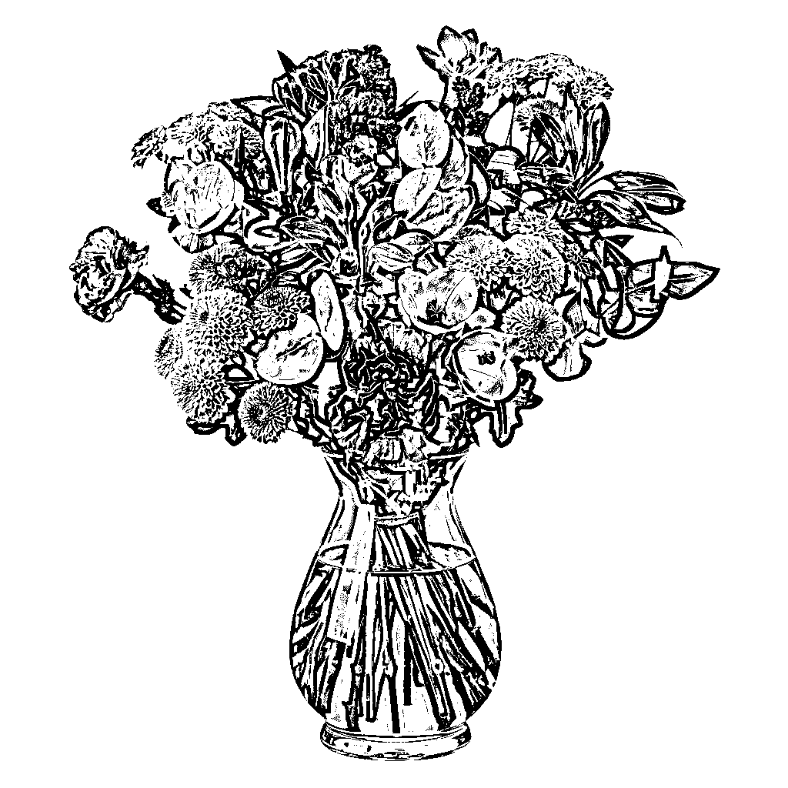

**Interpretacja:**
- **Globalne Otsu**: jednolity próg dla całego obrazu → dobre dla obrazów o równomiernym oświetleniu.
- **Trójklasowe Otsu**: wyodrębnia 3 regiony (tło, kwiaty, jasne akcenty) → lepsze rozróżnienie struktur o różnej intensywności.
- **Lokalne Otsu**: adaptacyjne progowanie uwzględniające lokalne zmiany oświetlenia → lepiej radzi sobie z nierównomiernym oświetleniem, szczegóły zachowane w ciemnych/jasnych obszarach.

## Zadanie 7
### Treść
Wyrównanie histogramu ⋆ (0.5 + 1.0 + 1.0)

Poniższy obraz to kadr z filmu „Le Manoir du Diable" („Rezydencja diabła")
– pierwszego, trwającego 3 minuty horroru w dziejach kinematografii (1896 r.).


Dla obrazu `RezydencjaDiabla.png` proszę:

(a) wyznaczyć skumulowany histogram,

(b) wykonać wyrównanie histogramu i podać wartość szarości w obrazie
wyjściowym H_equal(g) dla g = 40, g = 45 i g = 50,

(c) wykonać hiperbolizację histogramu z parametrem α = -1/3 i podać
wartość szarości w obrazie wyjściowym H_hyper(g) dla g = 40, g = 45
i g = 50.

Do rozwiązań b) i c) proszę załączyć obrazy wyjściowe i ich histogramy.

### Rozwiązania

Skrypt: `zad7/histogram_enhancement.py` (Python, NumPy/PIL/Matplotlib). Obraz wejściowy: `RezydencjaDiabla.png` (683×1024 px, zakres: [14, 228]).

#### (a) Skumulowany histogram

Wyznaczono histogram oryginalny i jego skumulowaną postać (CDF - Cumulative Distribution Function):

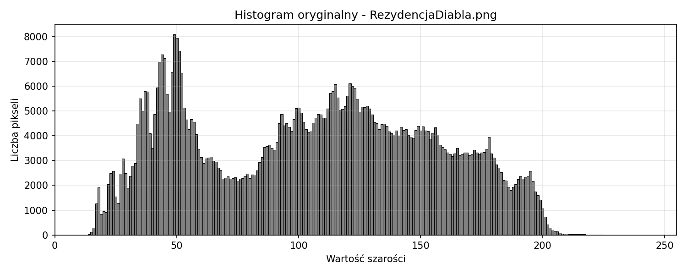

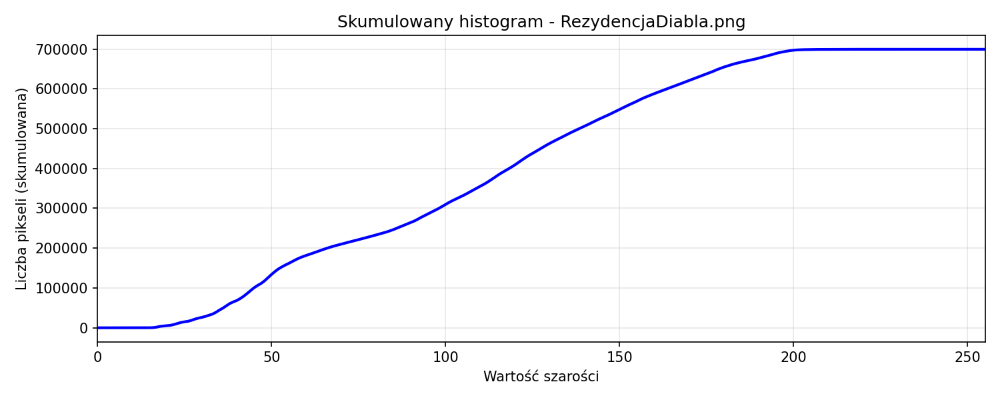

Oryginalny obraz ma ograniczony zakres wartości szarości, co powoduje niski kontrast.

#### (b) Wyrównanie histogramu

Zastosowano transformację wyrównującą histogram: **H_equal(g) = round(255 × CDF(g) / N)**

Wartości wyjściowe dla wskazanych poziomów szarości:
- **H_equal(40) = 24**
- **H_equal(45) = 36**
- **H_equal(50) = 48**

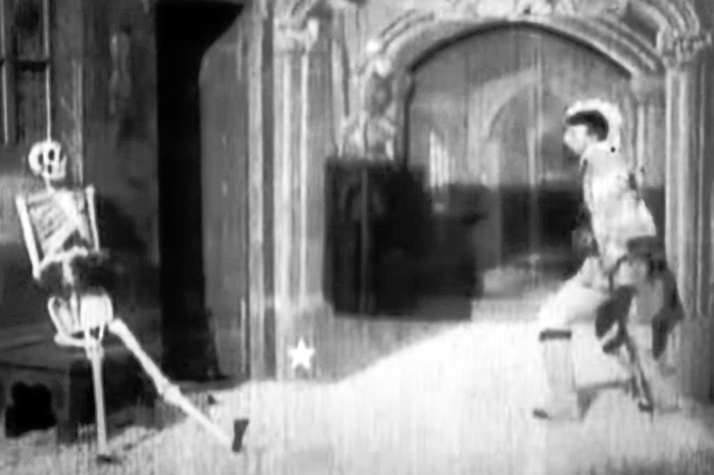

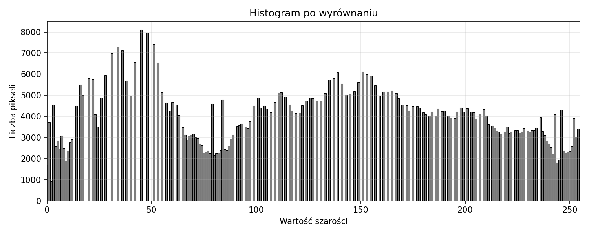

**Interpretacja:** Wyrównanie histogramu rozciąga zakres wartości na pełny przedział [0, 255], poprawiając kontrast. Histogram staje się bardziej równomierny, szczegóły w ciemnych i jasnych obszarach są lepiej widoczne.

#### (c) Hiperbolizacja histogramu (α = -1/3)

Zastosowano transformację hiperbolizującą: **H_hyper(g) = round(255 × [CDF(g)/N]^(1/(1+α)))**

Dla α = -1/3, wykładnik potęgi wynosi 1/(1-1/3) = 3/2 = 1.5.

Wartości wyjściowe dla wskazanych poziomów szarości:
- **H_hyper(40) = 7**
- **H_hyper(45) = 13**
- **H_hyper(50) = 21**


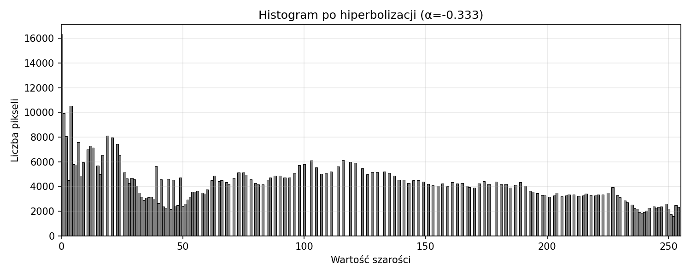

**Interpretacja:** Hiperbolizacja z α = -1/3 silniej rozciąga ciemne obszary (niskie wartości szarości) niż jasne. Wykładnik > 1 powoduje „wypychanie" wartości w kierunku ciemnych tonów, zwiększając kontrast w cieniach. Obraz wydaje się ciemniejszy, ale detale w ciemnych partiach są bardziej wyeksponowane niż przy standardowym wyrównaniu.

**Porównanie metod:**
- **Wyrównanie**: zbalansowane rozciągnięcie całego zakresu, równomierne rozłożenie wartości
- **Hiperbolizacja (α < 0)**: preferencja dla ciemnych tonów, silniejsze podkreślenie detali w cieniach

## Zadanie 9
### Treść
Zwiększenie kontrastu poprzez zastosowanie kolorów ⋆ (1)

Dla jednego z obrazów wyjściowych (przetworzonego obrazu `RezydencjaDiabla.png`) z zadania 7 proszę wykonać transformację obrazu zgodnie z
poniższym diagramem (zwiększenie kontrastu poprzez zastosowanie trzech
funkcji mapowania wartości szarości):

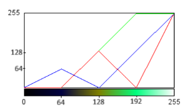

Opis diagramu:
- Niebieski: od [0, 0] linia prosta do [64, 64], następnie do [128, 0] i później do [255, 255]
- Czerwony: od [0, 0] do [64, 0], następnie do [128, 128], później do [192, 0] i na końcu do [255, 255]
- Zielony: od [0, 0] do [64, 0], następnie do [192, 255], później do [255, 255]

### Rozwiązanie

Skrypt: `zad9/pseudocoloring.py` (Python, NumPy/PIL/Matplotlib). Obraz wejściowy: wyrównany obraz z zadania 7b (`RezydencjaDiabla_equalized.png`).

Zaimplementowano trzy odcinkowe funkcje mapowania wartości szarości na kanały RGB:

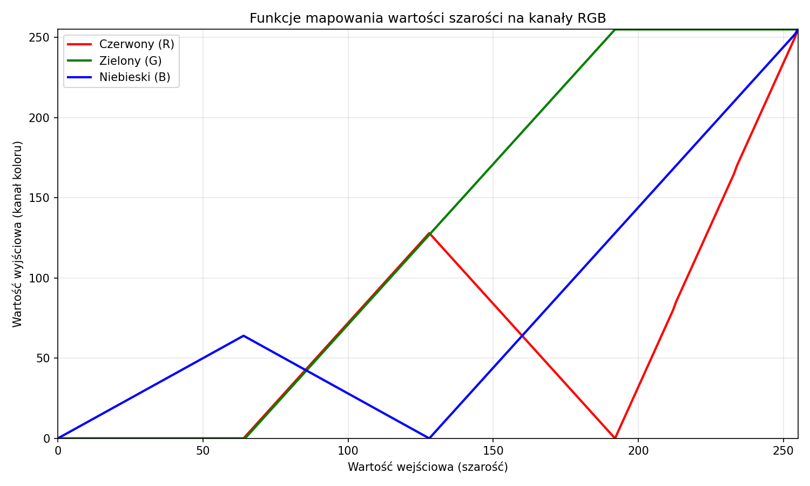

**Charakterystyka mapowania:**
- **Czerwony (R)**: Najsilniejszy w środkowych tonach (64-128), z drugim maksimum w jasnych obszarach (192-255)
- **Zielony (G)**: Gwałtowny wzrost w zakresie 64-192, stała wartość 255 dla jasnych tonów
- **Niebieski (B)**: Obecny w ciemnych tonach (0-64) i jasnych (128-255), z minimum w środku

**Przykładowe wartości mapowania:**

| Szarość (wejście) | R | G | B | Wynikowy kolor |
|-------------------|---|---|---|----------------|
| 0 | 0 | 0 | 0 | Czarny |
| 64 | 0 | 0 | 64 | Ciemny niebieski |
| 128 | 128 | 127 | 0 | Żółty/pomarańczowy |
| 192 | 0 | 255 | 128 | Cyjan/turkusowy |
| 255 | 255 | 255 | 255 | Biały |

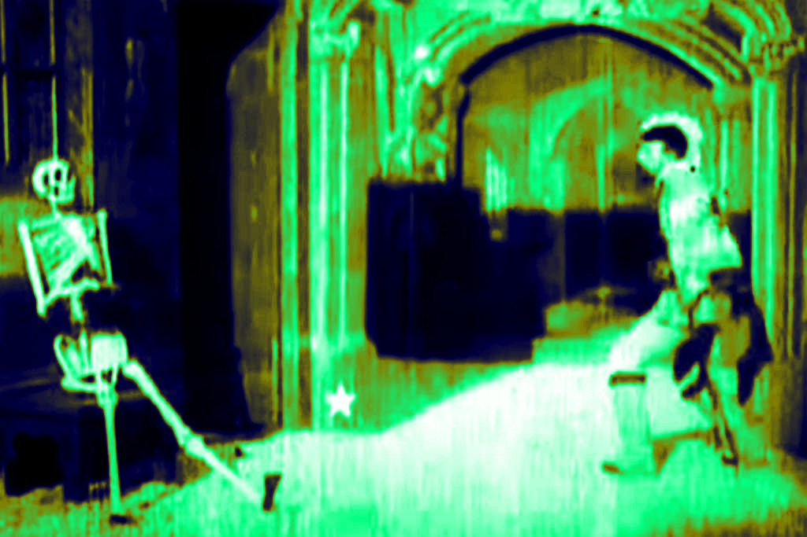

**Interpretacja:**

Pseudokolorowanie przypisuje różne kolory do różnych zakresów jasności oryginalnego obrazu w skali szarości:
- **Ciemne obszary (0-64)**: Odcienie niebieskiego
- **Średnio-ciemne (64-128)**: Żółto-pomarańczowe (dominacja R+G)
- **Średnio-jasne (128-192)**: Cyjanowo-zielone (dominacja G+B)
- **Jasne (192-255)**: Białe (wszystkie kanały wysokie)

Ta technika **znacząco zwiększa percepcyjny kontrast** między obszarami o zbliżonej jasności, które w oryginalnym obrazie w skali szarości byłyby trudne do rozróżnienia. Oko ludzkie lepiej rozróżnia różnice kolorów niż subtelne różnice w jasności, co czyni tę metodę skuteczną w wizualizacji struktur o niskim kontraście (np. w obrazach medycznych, astronomicznych czy historycznych fotografiach).

## Zadanie 10
### Treść
Zwiększenie kontrastu poprzez operacje punktowe oparte na histogramie ⋆ (1)

Zdjęcie poniżej (`CalunTurynski.png`, autor: Giuseppe Enrie, 1931 r., pozytyw) przedstawia odwzorowanie twarzy postaci na Całunie Turyńskim.


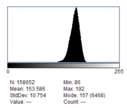

Opis histogramu:
od około 128 do 192 rośnie do maksa między nimi i potem spada znowu do minimum, pozostałe wartości między 0 a 255 to minimum

Tekst z histogramu:
N: 158652
Min: 86
Mean: 153.586
Max: 192
StdDev: 10.754
Mode: 157 (6468)
Value:--
Count:--


Proszę zaproponować i wykonać etapy przetwarzania obrazu oparte na
histogramie, które poprawią efekt wizualny (widoczność) postaci na zdjęciu. Do rozwiązania należy załączyć wyniki poszczególnych kroków metody
wraz z histogramami.

### Rozwiązanie

Skrypt: `zad10/histogram_enhancement.py` (Python, NumPy/PIL/Matplotlib). Obraz wejściowy: `CalunTurynski.png` (452×351 px).

**Analiza problemu:**
Oryginalny obraz ma bardzo wąski zakres wartości (86-192, tylko 106 z 256 możliwych), z większością pikseli skupioną wokół średniej 153.6 (moda: 157). To powoduje **ekstremalnie niski kontrast** - szczegóły twarzy są ledwo widoczne.

#### Krok 0: Oryginalny obraz

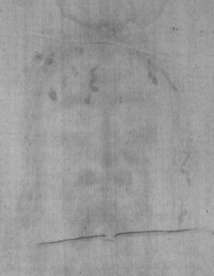
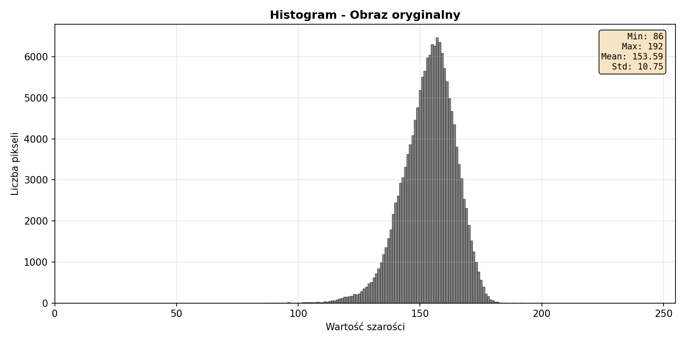

**Obserwacje:** 
- Zakres: [86, 192] - niewykorzystane ~60% dostępnych wartości
- Większość pikseli w zakresie 128-192 (szczyt przy 157)
- Bardzo niska wariancja (StdDev: 10.75) → brak kontrastu

#### Krok 1: Rozciąganie kontrastu (Contrast Stretching)

**Metoda:** Mapowanie zakresu percentyli 1-99% ([123, 174]) na pełny zakres [0, 255].

Transformacja: `g_out = 255 × (g_in - p1) / (p99 - p1)`

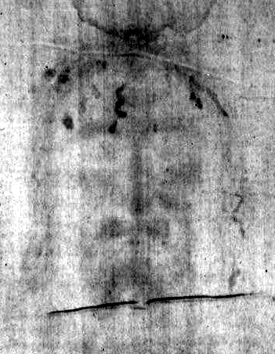
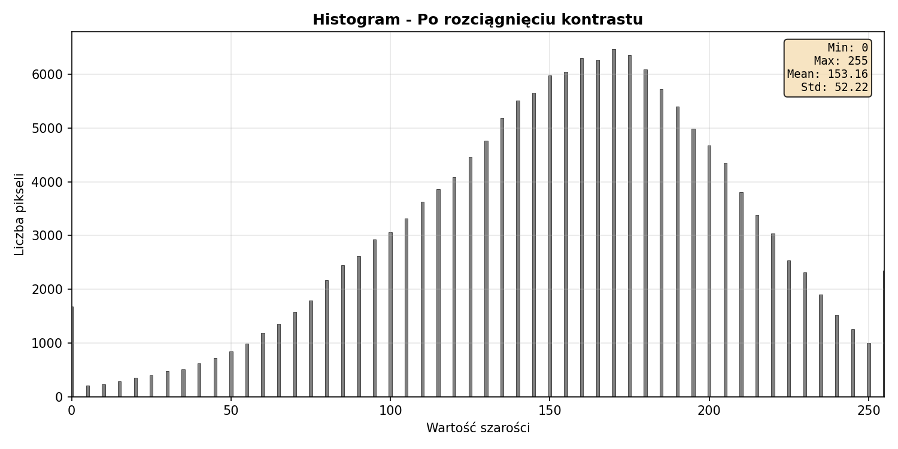

**Wynik:**
- Zakres rozszerzony do [0, 255]
- Wykorzystanie percentyli (zamiast min/max) zapobiega wpływowi pojedynczych outlierów
- Znacząco zwiększony kontrast, ale rozkład wciąż nierównomierny

#### Krok 2: Wyrównanie histogramu (Histogram Equalization)

**Metoda:** Transformacja oparta na CDF (Cumulative Distribution Function) - mapowanie wartości tak, by histogram był możliwie równomierny.

Transformacja: `g_out = round(255 × CDF(g_in) / N)`

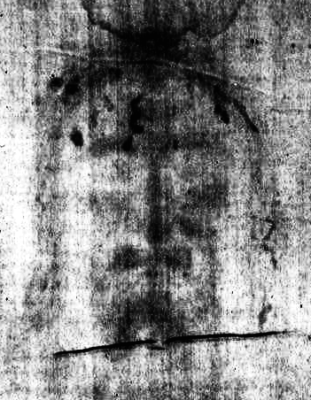
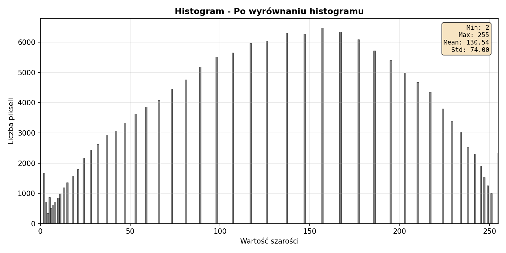

**Wynik:**
- Histogram znacznie bardziej równomierny
- **Dramatyczne zwiększenie kontrastu** - twarz wyraźnie widoczna
- Szczegóły w cieniach i światłach są lepiej rozróżnialne
- Możliwe wzmocnienie szumu w obszarach o pierwotnie niskiej wariancji

#### Krok 4: Korekcja gamma (γ = 0.7)

**Metoda:** Nieliniowa transformacja `g_out = 255 × (g_in/255)^γ` zastosowana do wyrównanego obrazu.

Dla γ < 1: rozjaśnia ciemne obszary (zwiększa widoczność w cieniach).

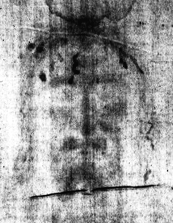
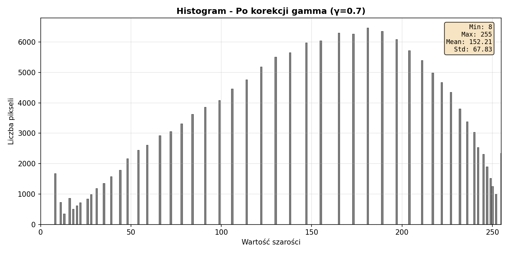

**Wynik:**
- Dodatkowe rozjaśnienie ciemnych obszarów
- Histogram przesunięty w kierunku jasnych tonów
- Lepsze wyeksponowanie detali w cieniach
- Efekt wizualny: jaśniejszy, bardziej czytelny obraz

#### Podsumowanie i interpretacja

**Pipeline przetwarzania:**
1. **Rozciąganie kontrastu** → wykorzystanie pełnego zakresu [0, 255]
2. **Wyrównanie histogramu** → równomierne rozłożenie wartości, maksymalizacja kontrastu
3. **Korekcja gamma** → dodatkowe rozjaśnienie ciemnych obszarów

**Efekt końcowy:**
- Twarz na całunie jest **wyraźnie widoczna** po przetwarzaniu (w przeciwieństwie do oryginalnego obrazu)
- Najlepsze rezultaty: **Krok 2 (wyrównanie histogramu)** lub **Krok 4 (+ gamma)** w zależności od preferencji jasności
- Krok 2 daje najbardziej naturalny wysokokontrast
- Krok 4 jest jaśniejszy, lepszy dla prezentacji detali w cieniach

**Zastosowane techniki:**
- Transformacje oparte wyłącznie na histogramie (zgodnie z poleceniem)
- Operacje punktowe (każdy piksel przetwarzany niezależnie)
- Wykorzystanie statystyk rozkładu (percentyle, CDF) dla optymalnego rozciągnięcia kontrastu

## Zadanie 14
### Treść
Operacje logiczne i arytmetyczne na obrazach ⋆ (0.5 + 0.5)

(a) Jakie operacje arytmetyczne należy wykonać, by podkreślić w kolorze
czerwonym krawędzie obiektów (obraz `bakterie_krawedzie.png`) na
obrazie `bakterie.png`?

 

(b) Jakie operacje logiczne należy wykonać, by podkreślić w kolorze cyjan (turkusowym, (R, G, B) = (0, 255, 255)) krawędzie obiektów na
obrazie `bakterieRGB.png`?

 

### Rozwiązanie

Skrypt: `zad14/image_operations.py` (Python, NumPy/PIL). Obrazy wejściowe: `bakterie.png` (grayscale, 512×512), `bakterieRGB.png` (RGB, 512×512), `bakterie_krawedzie.png` (maska krawędzi, 512×512).

#### (a) Operacje arytmetyczne - czerwone krawędzie

**Cel:** Podkreślenie krawędzi kolorem czerwonym (R=255, G=0, B=0) na obrazie w skali szarości.

**Strategia:**
1. Konwersja obrazu szarości na RGB (wszystkie kanały początkowo identyczne)
2. Normalizacja maski krawędzi do [0, 1]
3. Zastosowanie operacji arytmetycznych:

**Operacje:**
```
edges_norm = edges / 255  (normalizacja do [0, 1])

R_out = clip(R_gray + edges_norm × 255, 0, 255)
G_out = clip(G_gray - edges_norm × 255, 0, 255)
B_out = clip(B_gray - edges_norm × 255, 0, 255)
```

**Działanie:**
- **Kanał R:** Dodanie krawędzi zwiększa czerwony tam, gdzie edges=255 → jaśniejszy czerwony
- **Kanały G i B:** Odjęcie krawędzi zmniejsza zielony i niebieski → eliminuje je na krawędziach
- **Rezultat:** Tam gdzie edges=255, otrzymujemy R=wysoki, G=niski, B=niski = **kolor czerwony**

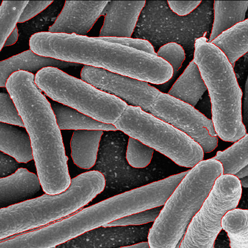

**Wyjaśnienie:** Operacje arytmetyczne (dodawanie/odejmowanie) pozwalają na płynne przejścia i kontrolowane manipulowanie wartościami kanałów. Dodanie do R i odjęcie od G/B daje czerwony odcień na krawędziach.

#### (b) Operacje logiczne - cyjanowe krawędzie

**Cel:** Podkreślenie krawędzi kolorem cyjan (R=0, G=255, B=255) na obrazie RGB.

**Strategia:**
Wykorzystanie operacji bitowych (AND, OR, NOT) do bezpośredniej manipulacji bitami pikseli.

**Operacje:**
```
R_out = R_orig AND (NOT edges)
G_out = G_orig OR edges
B_out = B_orig OR edges
```

**Działanie:**
- **Kanał R:** `AND NOT edges` → gdzie edges=255 (wszystkie bity=1), NOT edges=0 → R zostaje wyzerowany
- **Kanały G i B:** `OR edges` → gdzie edges=255 → G i B ustawione na 255
- **Rezultat:** Tam gdzie edges=255, otrzymujemy R=0, G=255, B=255 = **kolor cyjan**

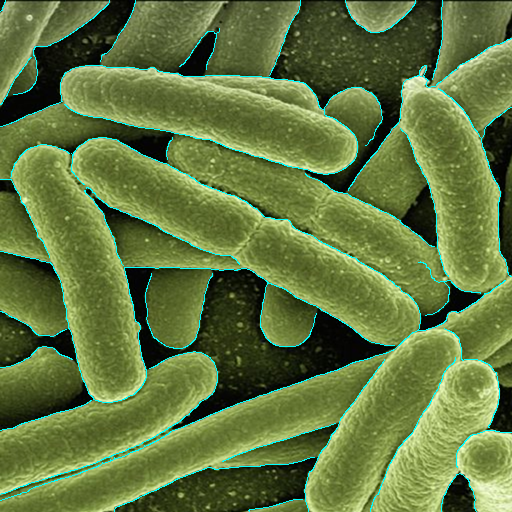

**Wyjaśnienie:** Operacje logiczne działają na poziomie bitów:
- **AND** wyzeruje kanał R na krawędziach (0 AND cokolwiek = 0)
- **OR** ustawi G i B na maksimum na krawędziach (255 OR cokolwiek = 255)
- Cyjan to brak czerwonego + maksimum zielonego i niebieskiego

#### Porównanie metod

| Aspekt | Operacje arytmetyczne (a) | Operacje logiczne (b) |
|--------|--------------------------|----------------------|
| **Typ operacji** | Dodawanie, odejmowanie | AND, OR, NOT (bitowe) |
| **Złożoność** | Wymaga normalizacji i clip | Bezpośrednie operacje bitowe |
| **Elastyczność** | Płynne przejścia, kontrola intensywności | Ostre przejścia, wartości binarne |
| **Wydajność** | Operacje na float, wolniejsze | Operacje na int, szybsze |
| **Zastosowanie** | Mieszanie obrazów, nakładki z alfa | Maski binarne, izolacja kanałów |

**Wnioski:**
- **Arytmetyczne:** Lepsze do płynnych efektów, wymagają uwagi na overflow (stąd clip)
- **Logiczne:** Idealne do ostrych masek binarnych, szybsze i prostsze dla operacji 0/255

## Zadanie 17
### Treść
Okienkowanie obrazu ⋆ (0.5 + 0.5 + 0.5)

Zaszumiony obraz `ptaki.png`:


Proszę:

(a) przetworzyć oknem sinusoidalnym,

(b) obraz wyjściowy z (a) wygładzić filtrem uśredniającym:

g'(m, n) = (1/9) Σ_{i=-1}^{1} Σ_{j=-1}^{1} g(m - i, n - j).

(c) dokonać korekty gamma obrazu z (b) z odpowiednio dobranym współczynnikiem γ tak, by średnie wartości jasności skorygowanego obrazu
i obrazu `ptaki.png` były do siebie zbliżone.

Wskazówka: Transformacja gamma w ImageJ: Process → Math.

(d) Proszę wykonać uśrednienie bezpośrednio na obrazie `ptaki.png` i opisowo porównać wynik z wynikiem z (c).

### Rozwiązanie

Skrypt: `zad17/windowing.py` (Python, NumPy/PIL/SciPy). Obraz wejściowy: `ptaki.png` (512×512 px, zaszumiony).

**Statystyki oryginalnego obrazu:**
- Średnia jasność: 105.55
- Odchylenie standardowe: 84.37
- Zakres: [0, 254]

#### (a) Przetwarzanie oknem sinusoidalnym

**Okno sinusoidalne (okno Hanna):**

Funkcja okna: `w(x, y) = sin²(πx/(W-1)) × sin²(πy/(H-1))`

gdzie x ∈ [0, W-1], y ∈ [0, H-1]

Okno jest gładkie, przyjmuje wartość 1 w centrum obrazu i płynnie spada do 0 na brzegach.

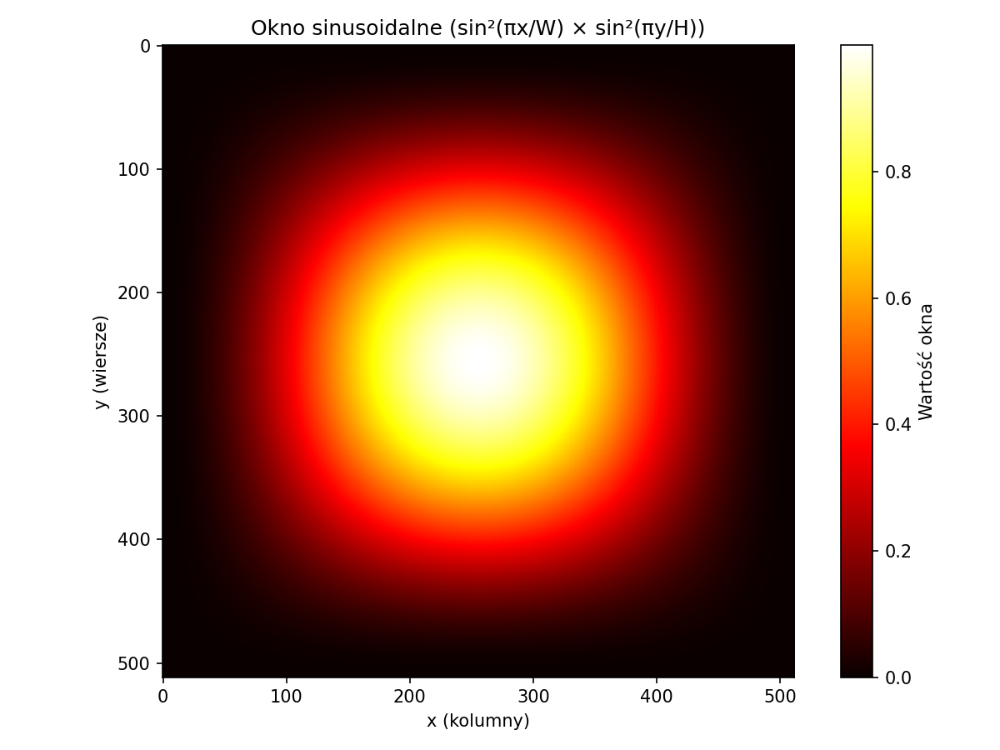

**Zastosowanie:** `g_windowed(x, y) = g_original(x, y) × w(x, y)`

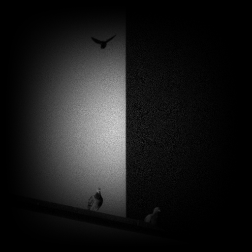

**Efekt:** 
- Średnia jasność spadła do 25.68 (brzegi wygaszone)
- Odchylenie std: 43.70
- Centrum obrazu zachowane, brzegi stopniowo wytłumione

#### (b) Filtr uśredniający 3×3

**Transformacja:** `g'(m, n) = (1/9) Σ_{i=-1}^{1} Σ_{j=-1}^{1} g(m-i, n-j)`

**Kernel:** 
```
K = (1/9) × [[1, 1, 1],
             [1, 1, 1],
             [1, 1, 1]]
```

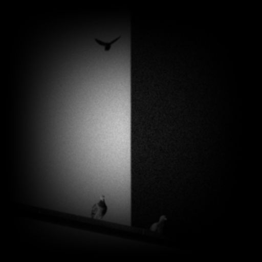

**Efekt:**
- Średnia: 25.34 (nieznacznie zmniejszona z 25.68)
- Odchylenie std: 43.43 (zmniejszone - efekt wygładzenia)
- Szum zredukowany, obraz bardziej gładki

#### (c) Korekcja gamma

**Cel:** Dopasowanie średniej jasności do oryginalnej (105.55).

**Transformacja gamma:** `g_out = 255 × (g_in / 255)^γ`

**Znaleziony współczynnik:** γ = 0.2005 (metodą bisekcji)

Dla γ < 1: rozjaśnianie ciemnych obszarów

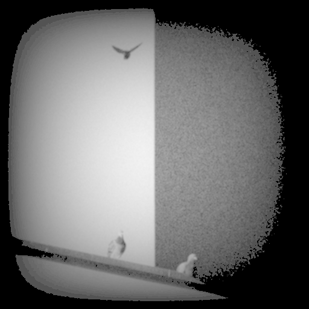

**Wynik:**
- Średnia: 105.97 (różnica od oryginału: 0.43)
- Odchylenie std: 75.59
- Jasność przywrócona, obraz czytelny

#### (d) Bezpośrednie uśrednianie

**Operacja:** Zastosowanie filtru uśredniającego 3×3 bezpośrednio na oryginalnym obrazie (bez okienkowania).

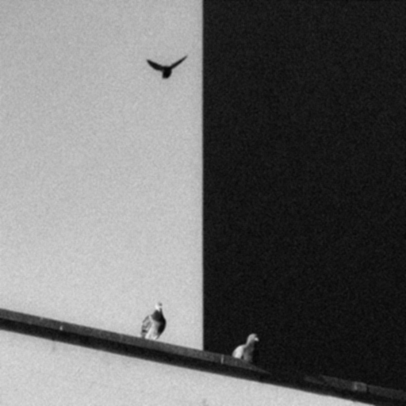

**Wynik:**
- Średnia: 105.10 (zachowana blisko oryginału)
- Odchylenie std: 83.63 (wysokie - zachowany szum na brzegach)

#### Porównanie metod (c) vs (d)

| Cecha | (c) Okienkowanie + filtr + gamma | (d) Bezpośrednie filtrowanie |
|-------|----------------------------------|------------------------------|
| **Średnia jasność** | 105.97 | 105.10 |
| **Odchylenie std** | 75.59 | 83.63 |
| **Szum** | Silnie zredukowany | Częściowo zredukowany |
| **Brzegi obrazu** | Wygładzone (okno wytłumiło) | Mogą zawierać artefakty |
| **Centrum obrazu** | Czyste, wysoka jakość | Dobra jakość, więcej szumu |
| **Złożoność** | 3 kroki (okno → filtr → gamma) | 1 krok (tylko filtr) |

**Wnioski:**

**(c) Okienkowanie przed filtrowaniem:**
- **Zalety:**
  - Okno sinusoidalne redukuje wpływ zaszumionych brzegów
  - Lepsze zachowanie jakości w centrum obrazu (obszar zainteresowania)
  - Zmniejsza artefakty brzegowe przed filtrowaniem
  - Efektywniejsza redukcja szumu (niższe std: 75.59)
- **Wady:**
  - Wymaga dodatkowej korekcji gamma (utrata jasności)
  - Bardziej złożone obliczeniowo
  - Informacja z brzegów częściowo utracona

**(d) Bezpośrednie filtrowanie:**
- **Zalety:**
  - Prostsze i szybsze (jeden krok)
  - Zachowuje informację z całego obrazu równomiernie
  - Naturalne zachowanie średniej jasności
- **Wady:**
  - Wyższe odchylenie std (83.63) - więcej pozostałego szumu
  - Równomierne traktowanie może propagować szum z brzegów
  - Możliwe artefakty jeśli brzegi są mocno zaszumione

**Rekomendacja:**
- Jeśli **centrum obrazu jest kluczowe** (np. obiekt centralny) → metoda (c) z okienkowaniem
- Jeśli **cały obraz jest ważny** lub szybkość ma znaczenie → metoda (d) bezpośrednia

## Zadanie 19
### Treść
Steganografia ⋆ (0.5 + 0.5)

W obrazie `AlbertEinstein-modified.png`:


Proszę:

(a) odczytać cytat Einsteina (obraz) schowany w płaszczyźnie bitowej,

(b) zastąpić informację innym obrazem i ukryć go w obrazie wejściowym. (Obraz wyjściowy należy załączyć do rozwiązań jako oddzielny plik.)

### Rozwiązanie

Skrypt: `zad19/steganography.py` (Python, NumPy/PIL). Obraz wejściowy: `AlbertEinstein-modified.png` (720×609 px).

**Technika LSB (Least Significant Bit):**

Steganografia LSB to metoda ukrywania informacji w najmłodszym bicie każdego piksela obrazu nośnikowego. Ponieważ zmiana LSB modyfikuje wartość piksela maksymalnie o ±1, różnica jest niewidoczna dla ludzkiego oka.

**Podstawy:**
- Każdy piksel 8-bitowy: `b₇ b₆ b₅ b₄ b₃ b₂ b₁ b₀` (od MSB do LSB)
- **LSB (b₀):** najmniej znaczący bit, zmiana ±1 w wartości piksela
- **Pojemność:** 1 bit na piksel = 1/8 rozmiaru obrazu w bajtach
- **Wytrzymałość:** Wrażliwa na kompresję stratną (JPEG), odporna na bezstratną (PNG)

#### (a) Odczytanie ukrytego cytatu Einsteina

**Metoda ekstrakcji:**

Dla każdego piksela P obrazu nośnikowego:
```
LSB(P) = P AND 1  (bitowe AND z maską 0x01)
Visible_LSB = LSB(P) × 255  (rozciągnięcie do [0, 255])
```

**Proces:**
1. Wczytanie obrazu `AlbertEinstein-modified.png` (720×609 = 438,480 pikseli)
2. Wydobycie płaszczyzny LSB metodą bitowego AND
3. Przeskalowanie do widocznego zakresu (0→0, 1→255)

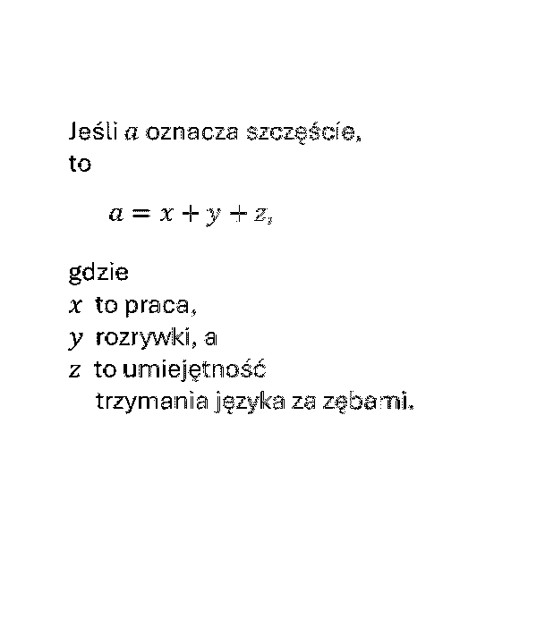

**Statystyki wydobytego obrazu:**
- Liczba unikalnych wartości: 2 (0 i 255) - obraz binarny
- Średnia wartość: 250.67 (dominacja białych pikseli)
- Liczba czarnych pikseli: 7,450 (~1.7% obrazu)
- Liczba białych pikseli: 431,030 (~98.3% obrazu)

**Alternatywna ekstrakcja (2 bity LSB):**

Niektóre implementacje używają 2 najmłodszych bitów dla lepszej jakości:

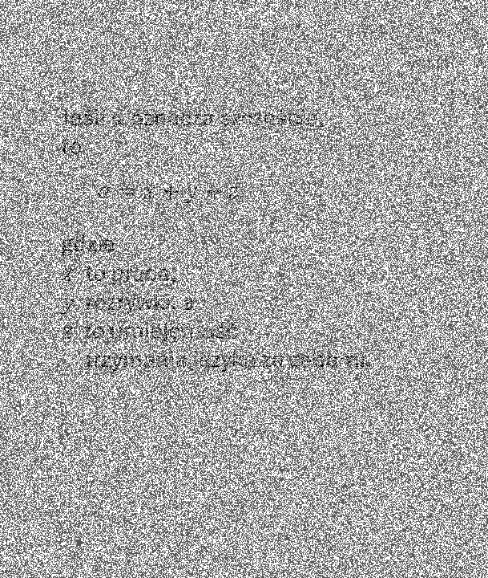

**Interpretacja:** 
Ukryty obraz to tekstowy cytat Einsteina zapisany jako czarny tekst na białym tle. Technika LSB pozwoliła na zapisanie obrazu tekstowego bez widocznej degradacji obrazu nośnika. Wydobyty cytat jest czytelny, chociaż jako obraz binarny (tylko 0 lub 255).

#### (b) Ukrycie nowego obrazu w obrazie nośnikowym

**Metoda osadzania:**

Dla każdego piksela P nośnika i odpowiadającego piksela S obrazu tajnego:
```
P_LSB_cleared = P AND 11111110₂  (wyzerowanie LSB)
S_MSB = (S > 127) ? 1 : 0  (progowanie obrazu tajnego)
P_stego = P_LSB_cleared OR S_MSB  (wstawienie tajnego bitu do LSB)
```

**Proces:**
1. Utworzenie przykładowego obrazu tajnego (geometryczny wzór z prostokątem, przekątnymi)
2. Progowanie obrazu tajnego do wartości binarnych (0/1)
3. Wyzerowanie LSB w oryginalnym obrazie Einsteina
4. Wstawienie progowanych danych tajnych do płaszczyzny LSB

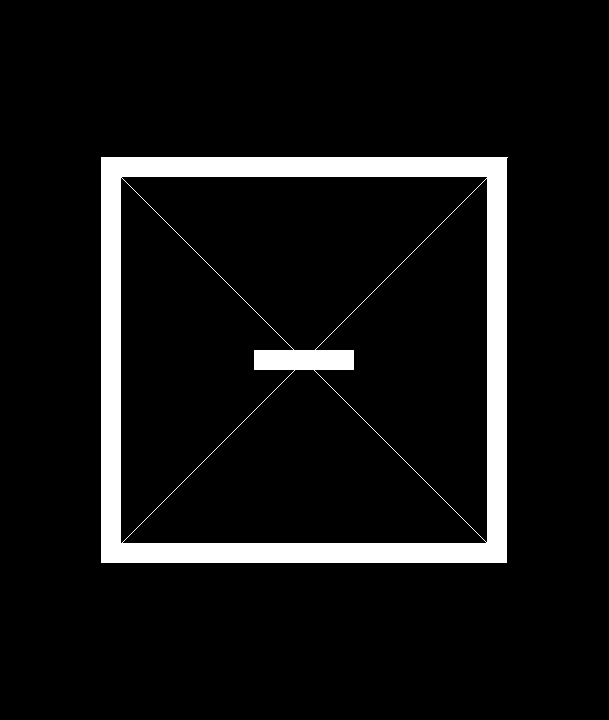

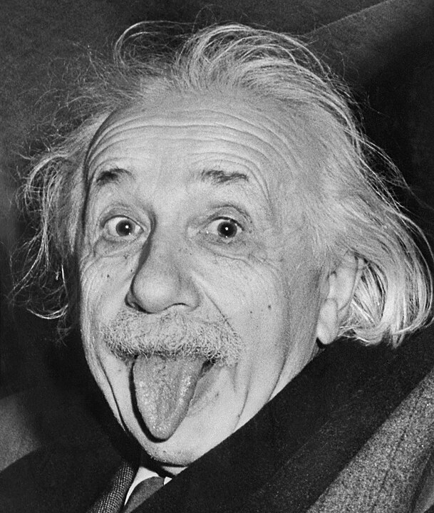

**Analiza różnic:**
```
Różnica = |Oryginalny - Steganogram|
Maksymalna różnica: 1 (zgodnie z teorią LSB)
Liczba zmienionych pikseli: 398,568 (~90.9%)
```

**Weryfikacja:**

Wydobycie ukrytego obrazu ze steganogramu:


**Status weryfikacji:** ✓ SUKCES - wydobyty obraz identyczny z oryginalnym obrazem tajnym

#### Charakterystyka metody LSB

| Aspekt | Opis |
|--------|------|
| **Pojemność** | 1 bit/piksel = obraz ukryty może mieć rozmiar 1/8 obrazu nośnika |
| **Widoczność** | Zmiana ±1 w wartości piksela - **niewidoczna** dla oka ludzkiego |
| **Wytrzymałość** | Słaba - kompresja JPEG niszczy dane; PNG bezpieczny |
| **Detekcja** | Podatna na analizę statystyczną (χ² test, histogram LSB) |
| **Zastosowania** | Znakowanie wodne, ukryte komunikaty, uwierzytelnianie |

#### Podsumowanie

**(a) Ekstrakcja:** Pomyślnie wydobyto ukryty cytat Einsteina z płaszczyzny LSB obrazu `AlbertEinstein-modified.png`. Cytat był zapisany jako obraz binarny (czarny tekst na białym tle), reprezentujący ~1.7% pikseli jako czarne (LSB=0) i 98.3% jako białe (LSB=1).

**(b) Osadzanie:** Ukryto nowy obraz geometryczny w oryginalnym obrazie Einsteina, tworząc steganogram `AlbertEinstein_with_secret.png`. Modyfikacja LSB w 90.9% pikseli spowodowała maksymalną zmianę wartości o ±1, co jest niewidoczne wizualnie. Weryfikacja potwierdziła poprawne odtworzenie ukrytego obrazu.

**Zalety LSB:**
- Bardzo prosta implementacja (operacje bitowe)
- Niska złożoność obliczeniowa
- Brak widocznych artefaktów
- Duża pojemność (1 bit/piksel)

**Ograniczenia LSB:**
- Wrażliwość na modyfikacje obrazu (kompresja, filtrowanie)
- Podatność na detekcję statystyczną
- Brak odporności na ataki (można łatwo nadpisać/zniszczyć)

**Zastosowania praktyczne:**
- **Znakowanie wodne:** uwierzytelnianie autorstwa
- **Komunikacja ukryta:** przesyłanie wiadomości w niewinnych plikach
- **Integralność danych:** detekcja modyfikacji obrazu
