# Zestaw 4

## 11. Filtrowanie obrazów w ImageJ ⋆ (1 + 1)

### Treść zadania

Zadanie dotyczy zastosowania zadanych jąder splotu na obrazie `YesNo_TestFiltrow.png`.

Plik obrazu (znajduje się w tym samym folderze):


(a) Wykonaj operacje filtrowania obrazu `YesNo_TestFiltrow.png` normalizowanymi jądrami splotu podanymi poniżej.

Jądro h_a (5×5):
```
0 0 1 0 0
0 2 2 2 0
1 2 5 2 1
0 2 2 2 0
0 0 1 0 0
```

Jądro h_b (3×3):
```
1 -2  1
-2  5 -2
1 -2  1
```

Jądro h_c (3×3):
```
0  1  1
-1  1  1
-1 -1  0
```

Jądro h_d (3×3):
```
1 -1 -1
1 -2 -1
1  1  1
```

(b) Odpowiedz:
- Które jądra są filtrami dolnoprzepustowymi, a które górnoprzepustowymi?
- Jakie krawędzie (kierunki: wschód, południowy-wschód, południe itd.) uwypukla filtr `h_c`?
- Jakie krawędzie wykrywa kierunkowy filtr gradientowy `h_d`?

### Rozwiązania

- Wyniki filtracji (punkt (a)):
	- 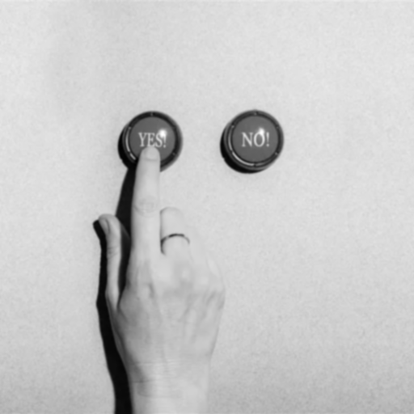 `h_a_filtered.png` (h_a — filtr wygładzający)
	- 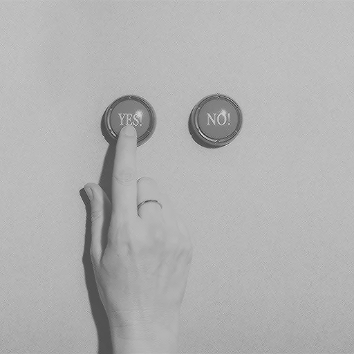 `h_b_filtered.png` (h_b — filtr ostrzący / band‑pass)
	- 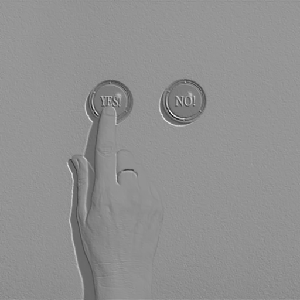 `h_c_filtered.png` (h_c — filtr kierunkowy)
	- 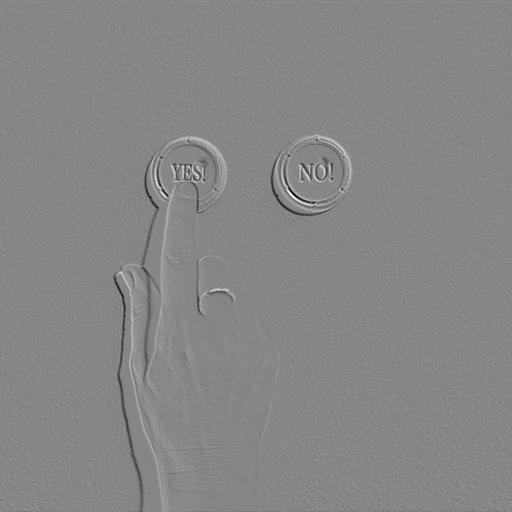 `h_d_filtered.png` (h_d — filtr krawędziowy / high‑pass)


Pytania w punkcie (b):
- Które jądra są filtrami dolnoprzepustowymi, a które górnoprzepustowymi?
    - h_a jest filtrem dolnoprzepustowym (wygładzającym).
    - h_b jest filtrem górnoprzepustowym (ostrzącym / band‑pass).
    - h_c jest filtrem górnoprzepustowym (kierunkowym / band‑pass).
    - h_d jest filtrem górnoprzepustowym (kierunkowym / high‑pass).
- Jakie krawędzie (kierunki: wschód, południowy-wschód, południe itd.) uwypukla filtr h_c?
    - Filtr h_c uwypukla krawędzie o orientacji SW-NE (jasna strona po stronie NE).
- Jakie krawędzie wykrywa kierunkowy filtr gradientowy h_d?
    - Filtr h_d wykrywa krawędzie o orientacji NE-SW (jasna strona po stronie SW).

## 14. Splot jąder filtrów ⋆ (0.5 + 1 + 0.5)

### Treść zadania

Obraz `Odd_Moon.png` należy wygładzić filtrem uśredniającym `h1` o rozmiarze 3×3, a następnie przetworzyć jednowymiarowym poziomym filtrem gradientowym `h2 = [0, 1, -1]`.

Plik obrazu (w tym samym folderze):


Proszę:
(a) wyznaczyć w ImageJ obrazy g1 = g ∗ h1 oraz g2 = g1 ∗ h2,
(b) połączyć splotem jądra h1 i h2 w jeden dwuwymiarowy filtr h3 = h1 ∗ h2 i wyznaczyć g3 = g ∗ h3,
(c) zinterpretować wyniki.

### Rozwiązania

oryginał:


obraz g1 = g ∗ h1:

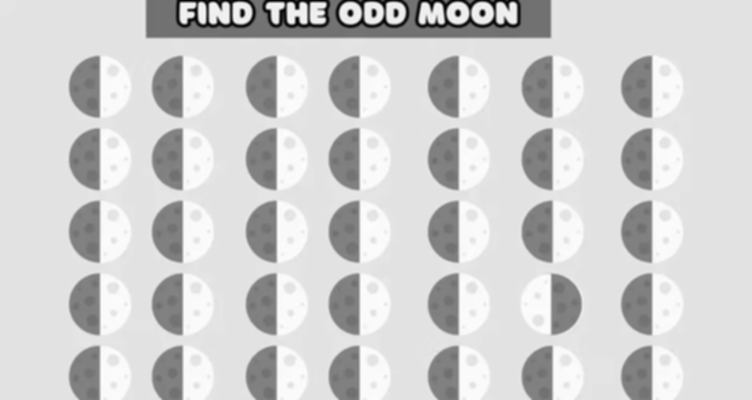

obraz g2 = g1 ∗ h2:


obraz g3 = g ∗ h3:

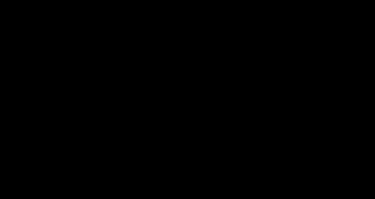

Interpretacja wyników:
- obraz g1 jest wygładzony (filtr h1 to filtr dolnoprzepustowy),
- obraz g2 uwypukla poziome krawędzie (filtr h2 to filtr gradientowy w poziomie),
- obraz g3 jest cały czarny, ponieważ jądro h3 ma sumę elementów równą zero (filtr h3 jest kombinacją filtra dolnoprzepustowego i gradientowego, co prowadzi do zaniku sygnału stałego).
- najłatwiej znaleźć księżyc na obrazie g2, ponieważ uwypuklone krawędzie w innym księżycu są przeciwnych kolorów co do pozostałych księżyców.

## 20. Znajdywanie krawędzi w obrazie ⋆ (0.5 + 0.5 + 0.5)

### Treść zadania

Funkcja wykrywająca krawędzie (`Find Edges`) w ImageJ wykorzystuje dwa operatory Sobela h1 i h2, które generują pochodne pionowe i poziome w obrazie wejściowym `g`:

h1 =
```
-1 -2 -1
 0  0  0
 1  2  1
```

h2 =
```
-1  0  1
-2  0  2
-1  0  1
```

Obraz wyjściowy `f` obliczany jest ze wzoru:
```
f = sqrt( (g ∗ h1)^2 + (g ∗ h2)^2 )
```

Plik obrazu (w tym samym folderze):


Wykonaj operacje (na 32 bitach) dla obrazu `Escher.png`:
(a) wykonaj sploty g1 = g ∗ h1 (pionowa pochodna) i g2 = g ∗ h2 (pozioma pochodna),
(b) oblicz obraz wyjściowy g3 = sqrt(g1^2 + g2^2),
(c) porównaj wynik z funkcją `Find Edges` w ImageJ i zinterpretuj różnice.

Zdjęcie: The M.C. Escher Company B.V.

### Rozwiązania

Do wykonania zadania użyto Sobela na 32 bitach (float).

oryginał:


g1 = g ∗ h1 (pionowa pochodna) (abs):


g2 = g ∗ h2 (pozioma pochodna) (abs):

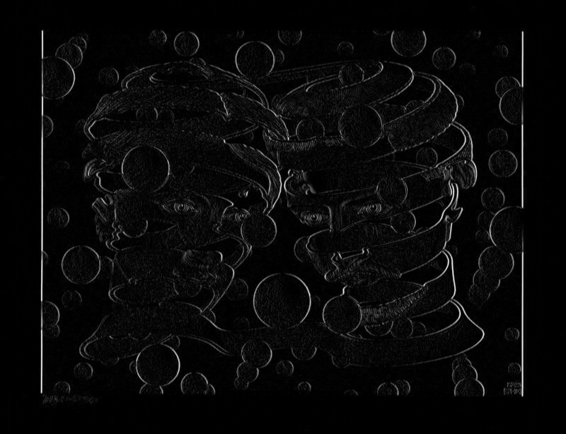

g3 = sqrt(g1^2 + g2^2):


ImageJ (Find Edges):


Interpretacja różnic:
- wynik z ImageJ jest podobny do g3 ale ma o wiele wyższy kontrast (większa jasność krawędzi),
- krawędzie w ImageJ są bardziej wyraźne i jakby grubsze.

## 21. Detektor krawędzi Kirscha ⋆ (1 + 0.5)

### Treść zadania

Detektor Kirscha wykorzystuje 8 jąder typu Kirsch (operacje na 8 bitach). Pierwsze jądro h1 to:
```
-3  5  5
-3  0  5
-3 -3 -3
```

Jądra h2..h8 to obroty jądra h1 o 45°, 90°, ..., 315°. Obraz wyjściowy oblicza się jako maksymalną odpowiedź ze wszystkich kierunków:
```
f(m,n) = max_{i=1..8} ( g ∗ h_i )(m,n)
```

Zastosuj detektor Kirscha na obrazie z zadania 20 i porównaj wynik z `Find Edges`.

### Rozwiązania

oryginał:


Find Edges:


Kirsch mapa kierunkowa:

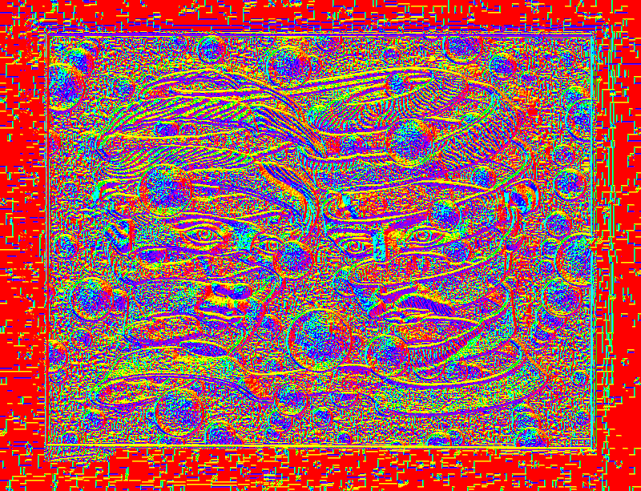

Kirsch wynik detekcji krawędzi:

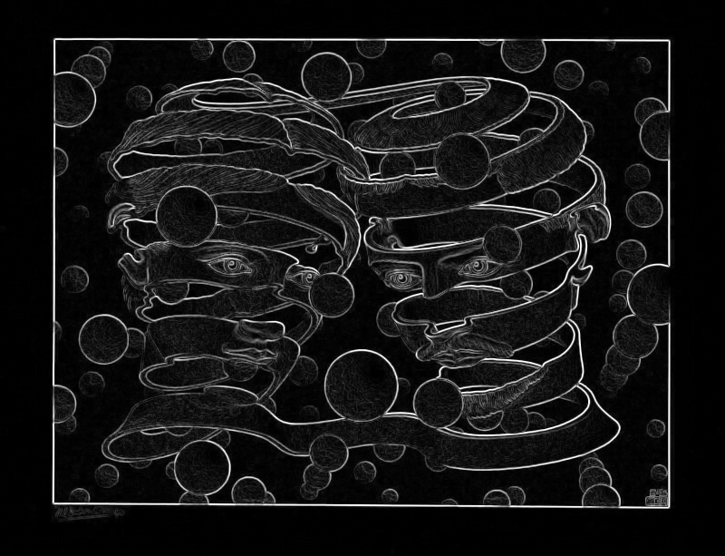

## 22. Highboost filtering ⋆ (0.5)

### Treść zadania

Zastosuj technikę maskowania nieostrego (Highboost filtering) do wyostrzenia obrazu `nosorozec.png`.

Plik obrazu (w tym samym folderze):


Jako filtr wygładzający użyj filtra Gaussa. Do rozwiązania dołącz obraz maski nieostrej (unsharp mask).

### Rozwiązania
Wyniki filtracji (punkt (a)):
    - 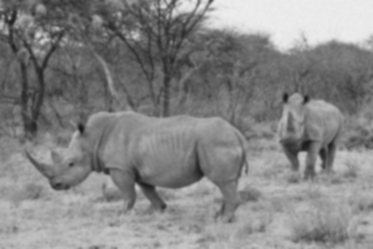 `nosorozec_blurred.png` (obrazu wygładzony filtrem Gaussa, sigma=2)
    - 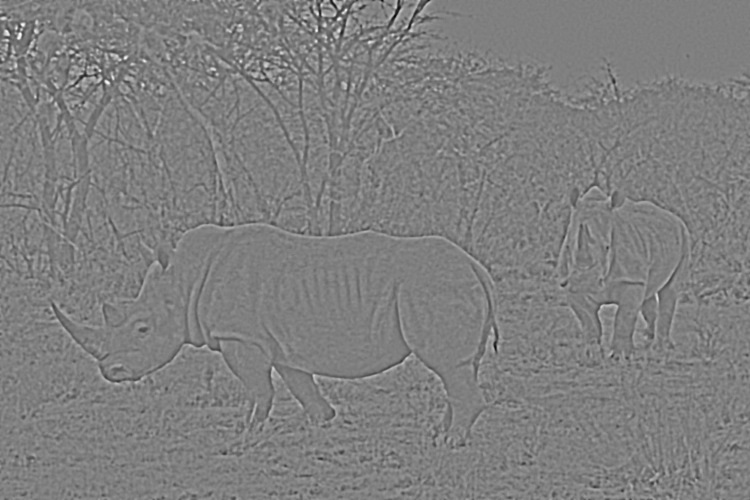 `nosorozec_unsharp_mask.png` (maska nieostra — środek obrazu odpowiada zeru, jaśniejsze/ciemniejsze wartości to dodatnie/ujemne składowe maski)
    -  `nosorozec_highboost.png` (wynik highboost: oryginał + amount * mask; użyto amount=1.5)

Krótka interpretacja:
- Maska nieostra (orig − blurred) wydobywa składowe wysokoczęstotliwościowe (krawędzie, detale). Highboost zwiększa tę składową i dodaje ją do oryginału, przez co krawędzie i detale stają się wyraźniejsze bez silnego wzmocnienia szumu przy umiarkowanym współczynniku.

## 24. Dekonwolucja obrazu ⋆ (2)

### Treść zadania

Obraz `wiewiorka_filtered.png` to wynik filtrowania obrazu wejściowego filtrem dolnoprzepustowym o współczynnikach dwumianu Newtona:

```
h = (1/256) *
[[1,  4,  6,  4, 1],
 [4, 16, 24, 16, 4],
 [6, 24, 36, 24, 6],
 [4, 16, 24, 16, 4],
 [1,  4,  6,  4, 1]]
```

Plik obrazu (w tym samym folderze):


Wykonaj dekonwolucję metodą Van Citterta. Do rozwiązania dołącz obrazy uzyskane po k = 2, 5, 15 iteracjach algorytmu oraz obrazy różnic (symetryczne) tych obrazów względem obrazu wejściowego.

### Rozwiązania

Wyniki dekonwolucji (punkt (a)):
    -  `wiewiorka_input_gray.png` (wejściowy obraz w skali szarości)
    -  `kernel_h.png` (jądro h użyte do dekonwolucji)
    -  `wiewiorka_restored_k2.png` (wynik po k = 2 iteracjach)
    - 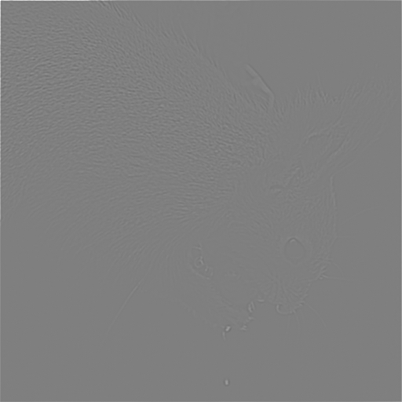 `wiewiorka_diff_k2.png` (różnica f_k − g, wizualizowana wokół mid‑gray)
    -  `wiewiorka_restored_k5.png` (wynik po k = 5 iteracjach)
    - 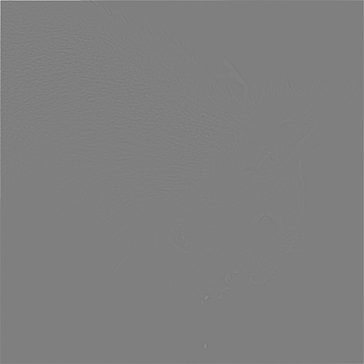 `wiewiorka_diff_k5.png`
    - 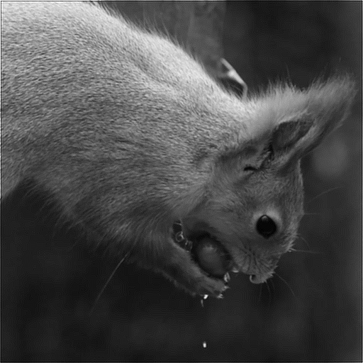 `wiewiorka_restored_k15.png` (wynik po k = 15 iteracjach)
    - 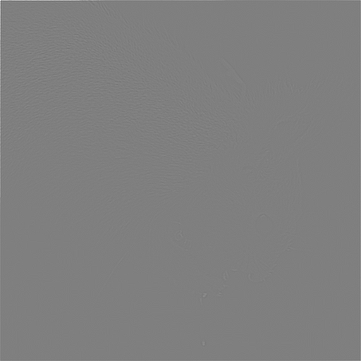 `wiewiorka_diff_k15.png`

Krótka interpretacja:
- Van Cittert przywraca część utraconych wysokich częstotliwości; dla małej liczby iteracji (k=2,5) widoczne jest delikatne wyostrzanie i przywracanie detali.
- Dla większej liczby iteracji (k=15) może pojawić się nadmierne wzmocnienie szumu i artefakty (ringing). W praktyce warto dobrać parametr relaksacji (alpha) i liczbę iteracji ostrożnie lub zastosować regularizację.